## Establish a type scale

Most interfaces use way too many font sizes. Unless a team has a rigid design system in place, it’s not uncommon to find that every pixel value from 10px to 24px has been used in the UI somewhere.

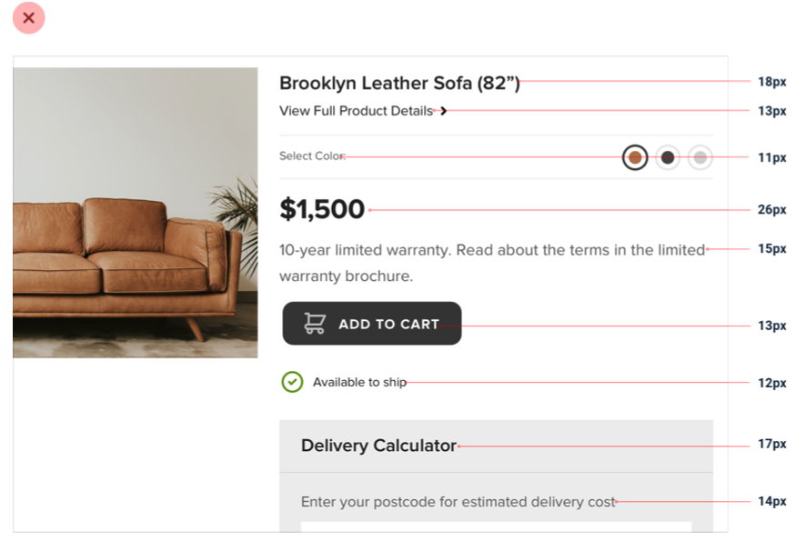

Choosing font sizes without a system is a bad idea for two reasons:

1. It leads to annoying inconsistencies in your designs.
2. It slows down your workflow.

So how do you define a type system?

### Choosing a scale

Just like with spacing and sizing, a linear scale won’t work. Smaller jumps between font sizes are useful at the bottom of the scale, but you don’t want to waste time deciding between 46px and 48px for a large headline.

#### Modular scales

One approach is to calculate your type scale using a ratio, like 4:5 (a “major third”), 2:3 (a “perfect fifth”), or perhaps the “golden ratio”, 1:1.618. This is often called a “modular scale”.

You start with a sensible base value (16px is common since it’s the default font size for most browsers), apply your ratio to get the next value, then apply your ratio to that value to get the next value, and so on and so forth:


The mathematical purity of this approach is alluring, but in practice, it’s not perfect for a couple of reasons.

##### 1. You end up with fractional values.

Using a 16px base and 4:5 ratio, your scale will end up with lots of sizes that don’t land right on the pixel, like 31.25px, 39.063px, 48.828px, etc. Browsers all handle subpixel rounding a little bit differently, so it’s best to avoid fractional sizes if you can avoid it.

If you do want to use this approach, make sure you round the values yourself when defining the scale to avoid off-by-one pixel issues across browsers.

##### 2. You usually need more sizes.

This approach can work well if you’re defining a type scale for long form content like an article, but for interface design, the jumps you get using a modular scale are often a bit too limiting.


With a (rounded) 3:4 type scale, you get sizes like 12px, 16px, 21px, and 28px. While this might not seem too limiting on the surface, in practice you’re going to wish you had a size between 12px and 16px, and another between 16px and 21px.

You could use a tighter ratio like 8:9, but at this point you’re just trying to pick a scale that happens to match the sizes you already know you want.

#### Hand-crafted scales

For interface design, a more practical approach is to simply pick values by hand. You don’t have to worry about subpixel rounding errors this way, and you have total control over which sizes exist instead of outsourcing that job to some mathematical formula.

Here’s an example of a scale that works well for most projects and aligns nicely with the spacing and sizing scale recommended in “Establishing a spacing and sizing system”:

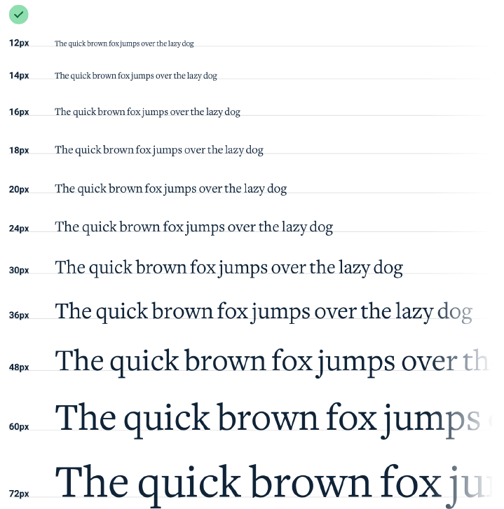

It’s constrained just enough to speed up your decision making, but isn’t so
limited as to make you feel like you’re missing a useful size.

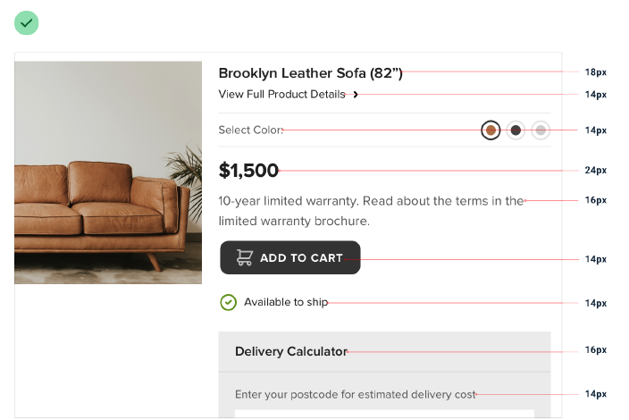

#### Avoid em units

When you’re building a type scale, don’t use em units to define your sizes.

Because em units are relative to the current font size, the computed font size
of nested elements is often not actually a value in your scale.

For example, say you’ve defined an em-based type scale like this:


If you give an element a font size of 1.25em (20px by default), inside of that
element 1em is now equal to 20px. That means that if you give one of the
nested elements a font size of .875em, the actual computed font size is
17.5px, not a value from your type scale!

Stick to px or rem units — it’s the only way to guarantee you’re actually
sticking to the system.

## Use good fonts

With thousands of different typefaces out there to choose from, separating
the good from the bad can be an intimidating task.

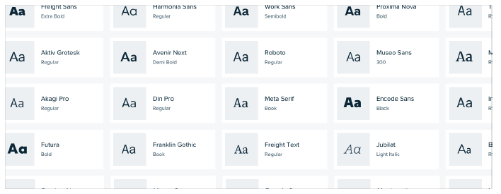

Developing an eye for all of the details that make a good typeface can take
years. You probably don’t have years, so here are a few tricks you can use to
start picking out high quality typefaces right away.

### Play it safe

For UI design, your safest bet is a fairly neutral sans-serif — think something like Helvetica.

If you really don’t trust your own taste, one great option is to rely on the system font stack:

```
-apple-system, Segoe UI, Roboto, Noto Sans, Ubuntu, Cantarell, Helvetica Neue;
```

It might not be the most ambitious choice, but at least your users will
already be used to seeing it.

### Ignore typefaces with less than five weights

This isn’t always true, but as a general rule, typefaces that come in a lot of different weights tend to be crafted with more care and attention to detail than typefaces with fewer weights.

Many font directories (like Google Fonts) will let you filter by “number of styles”, which is a combination of the available weights as well as the italic variations of those weights.

A great way to limit the number of options you have to choose from is to
crank that up to 10+ (to account for italics):

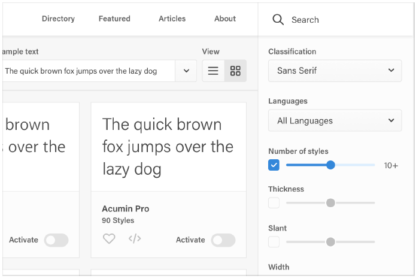

On Google Fonts specifically, that cuts out 85% of the available options,
leaving you with less than 50 sans-serifs to choose from.

### Optimize for legibility

When someone designs a font family, they are usually designing it for a
specific purpose. Fonts meant for headlines usually have tighter letterspacing and shorter lowercase letters (a shorter x-height), while fonts meant for smaller sizes have wider letter-spacing and taller lowercase letters.

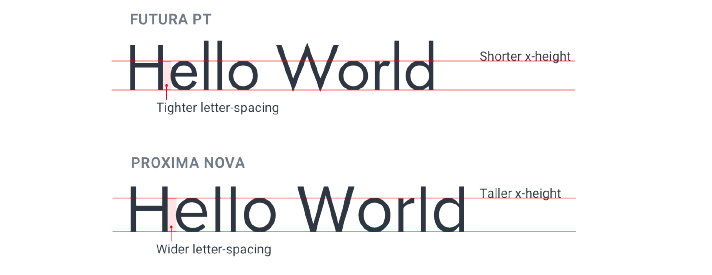

Keep this in mind and avoid using condensed typefaces with short x-heights for your main UI text.

### Trust the wisdom of the crowd

If a font is popular, it’s probably a good font. Most font directories will let you sort by popularity, so this can be a great way to limit your choices.

This is especially useful when you’re trying to pick out something other than a neutral UI typeface. Picking a nice serif with some personality for example can be tough.

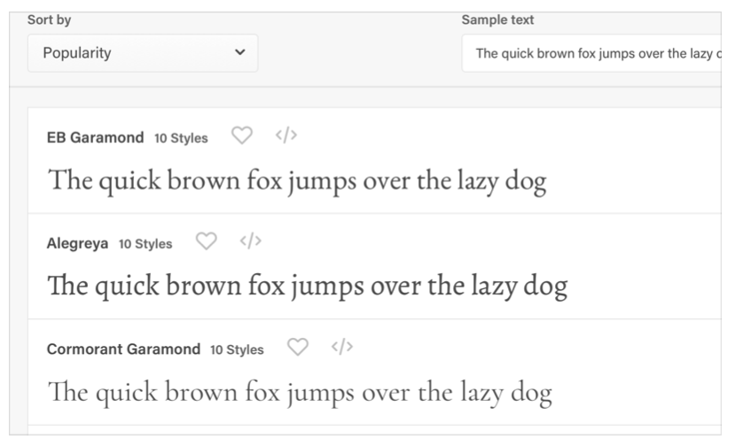

Leveraging the collective decision-making power of thousands of other people can make it a lot easier.

### Steal from people who care

Inspect some of your favorite sites and see what typefaces they are using.

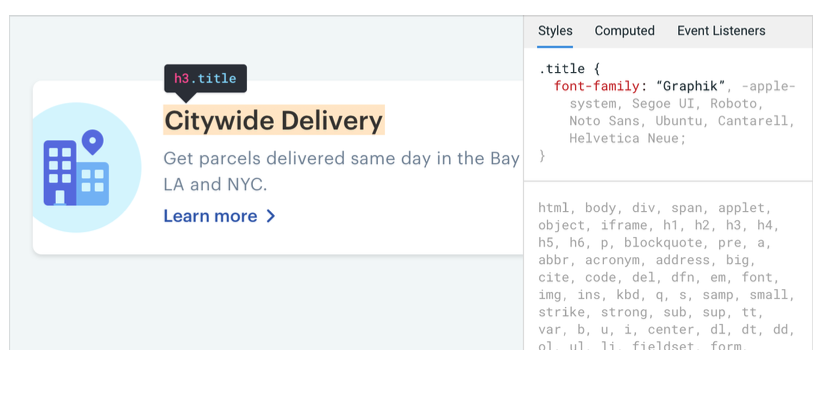

There are a lot of great design teams out there full of people with really strong opinions about typography, and they’ll often choose great fonts that you might have never found using some of the safer approaches outlined above.

### Developing your intuition

Once you start paying closer attention to the typography on well-designed sites, it’s not long before you feel pretty comfortable labeling a typeface as awesome or terrible.

You’re gonna be a type snob soon enough, but the advice outlined above will help get you by in the meantime.

## Keep your line length in check

When styling paragraphs, it’s easy to make the mistake of fitting the text to your layout instead of trying to create the best reading experience.

Usually this means lines that are too long, making text harder to read.


For the best reading experience, make your paragraphs wide enough to fit between 45 and 75 characters per line. The easiest way to do this on the web is using em units, which are relative to the current font size. A width of 20-35em will get you in the right ballpark.


Going a bit wider than 75 characters per line can sometimes work too, but be aware that you’re entering risky territory — stick to the 45-75 range if you want to play it safe.

### Dealing with wider content

If you’re mixing paragraph text with images or other large components, you should still limit the paragraph width even if the overall content area needs to be wider to accommodate the other elements.

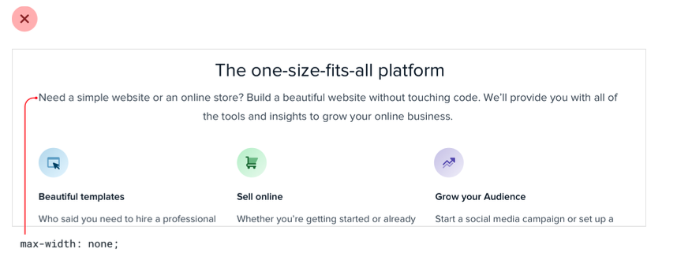

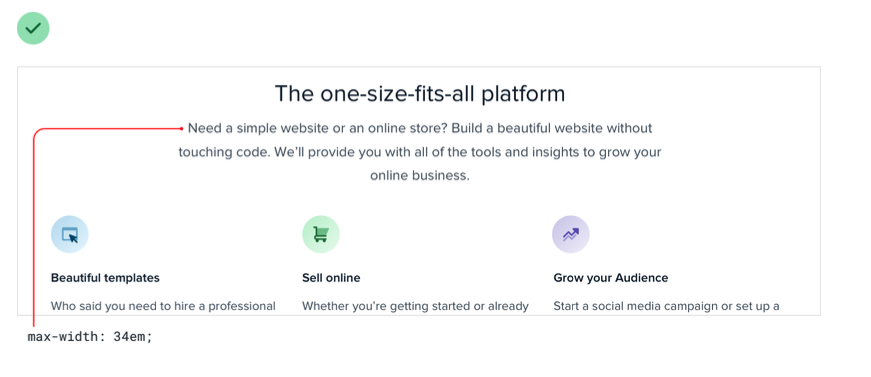

It might seem counterintuitive at first to use different widths in the same content area, but the result almost always looks more polished.

## Baseline, not center

There are a lot of situations where it makes sense to use multiple font sizes to create hierarchy on a single line.

For example, maybe you’re designing a card that has a large title in the top left and a smaller list of actions in the top right.

When you’re mixing font sizes like this, your instinct might be to vertically center the text for balance:


When there’s a decent amount of space between the different font sizes it often won’t look bad enough to catch your attention, but when the text is close together the awkward alignment becomes more obvious:


A better approach is to align mixed font sizes by their baseline, which is the imaginary line that letters rest on:


When you align mixed font sizes by their baseline, you’re taking advantage of an alignment reference that your eyes already perceive.

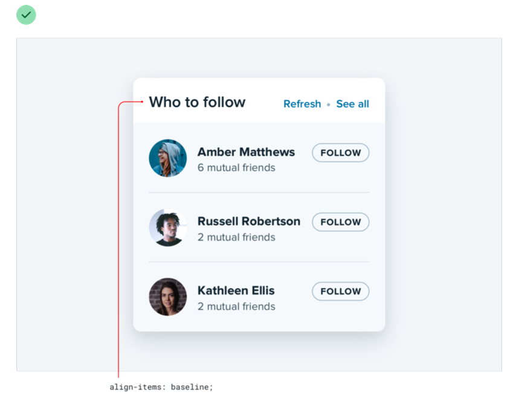

The result is a simpler, cleaner look than what you get when you center two pieces of text and offset their baselines.

## Line-height is proportional

You might have heard the advice that a line-height of about 1.5 is a good starting point from a readability perspective.


While that’s not necessarily untrue, choosing the right line-height for your text is a bit more complicated than just using the same value across the board in all situations.

### Accounting for line length

The reason we add space between lines of text is to make it easy for the reader to find the next line when the text wraps. Have you ever accidentally read the same line of text twice, or accidentally skipped a line? The line- height was probably too short.

When lines of text are spaced too tightly, it’s easy to finish reading a line of text at the right edge of a page then jump your eyes all the way back to the left edge only to be unsure which line is next.


This problem is magnified when lines of text are long. The further your eyes have to jump horizontally to read the next line, the easier it is to lose your place.

That means that your line-height and paragraph width should be proportional — narrow content can use a shorter line-height like 1.5, but wide content might need a line-height as tall as 2.


### Accounting for font size

Line length isn’t the only factor in choosing the right line-height — font size has a big impact as well.

When text is small, extra line spacing is important because it makes it a lot easier for your eyes to find the next line when the text wraps.

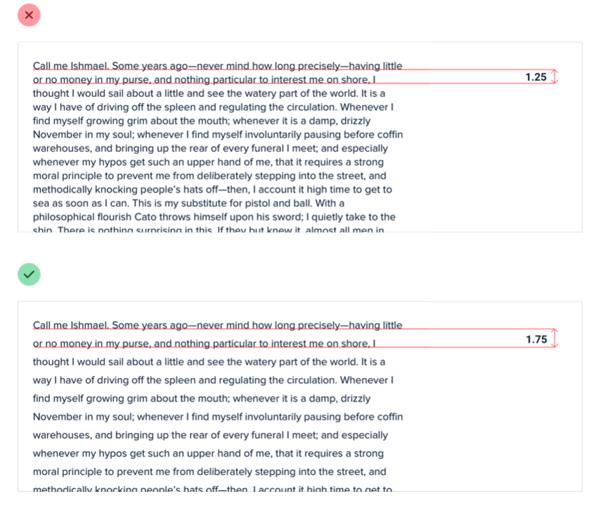

But as text gets larger, your eyes don’t need as much help. This means that for large headline text you might not need any extra line spacing, and a line- height of 1 is perfectly fine.


Line-height and font size are inversely proportional — use a taller line-height for small text and a shorter line-height for large text.

## Not every link needs a color

When you’re including a link in a block of otherwise non-link text, it’s important to make sure that the link stands out and looks clickable.

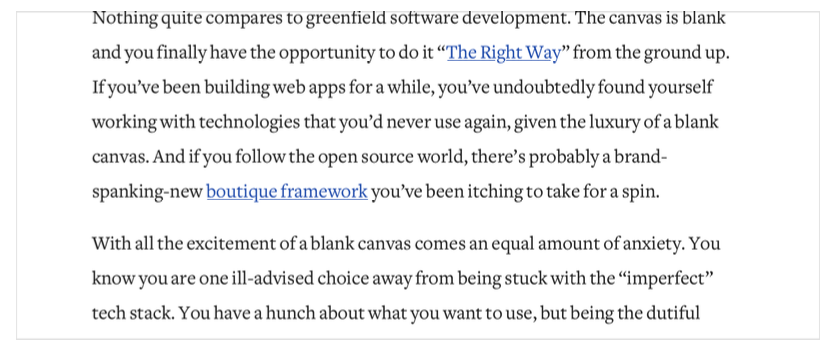

But when you’re designing an interface where almost everything is a link, using a treatment designed to make links “pop” in paragraph text can be really overbearing.


Instead, emphasize most links in a more subtle way, like by just using a heavier font weight or darker color.


Some links might not even need to be emphasized by default at all. If you’ve got links in your interface that are really ancillary and not part of the main path a user takes through the application, consider adding an underline or changing the color only on hover.

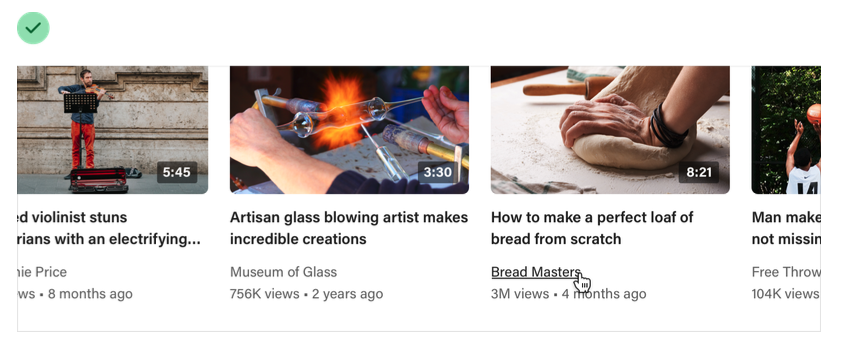

They’ll still be discoverable to any users who think to try, but won’t compete for attention with more important actions on the page.

## Align with readability in mind

In general, text should be aligned to match the direction of the language it’s written in. For English (and most other languages), that means that the vast majority of text should be left-aligned.


Other alignment options do have their place though, you just need to use them effectively.

### Don’t center long form text

Center-alignment can look great for headlines or short, independent blocks of text.


But if something is longer than two or three lines, it will almost always look better left-aligned.

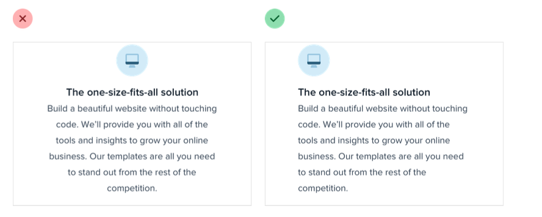

If you’ve got a few blocks of text you want to center but one of them is a bit too long, the easiest fix is to rewrite the content and make it shorter:

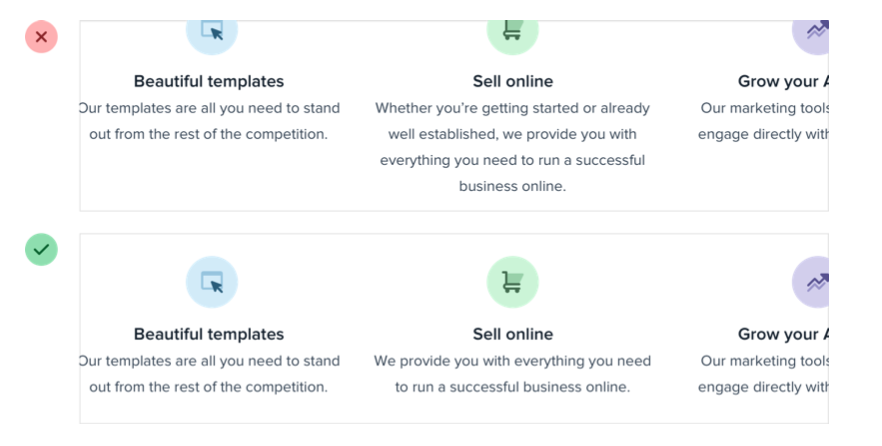

Not only will it fix the alignment issue, it will make your design feel more consistent, too.

### Right-align numbers

If you’re designing a table that includes numbers, right-align them.

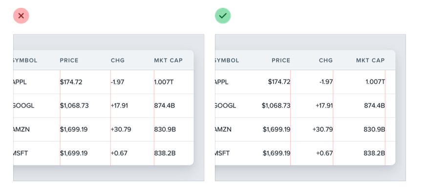

When the decimal in a list of numbers is always in the same place, they’re a lot easier to compare at a glance.

### Hyphenate justified text

Justified text looks great in print and can work well on the web when you’re going for a more formal look, but without special care, it can create a lot of awkward gaps between words:


To avoid this, whenever you justify text, you should also enable hyphenation:


Justified text works best in situations where you’re trying to mimic a print look, perhaps for an online magazine or newspaper. Even then, left aligned text works great too, so it’s really just a matter of preference.

## Use letter-spacing effectively

When styling text, a lot of effort is put into getting the weight, color, and line- height just right, but it’s easy to forget that letter-spacing can be tweaked, too.

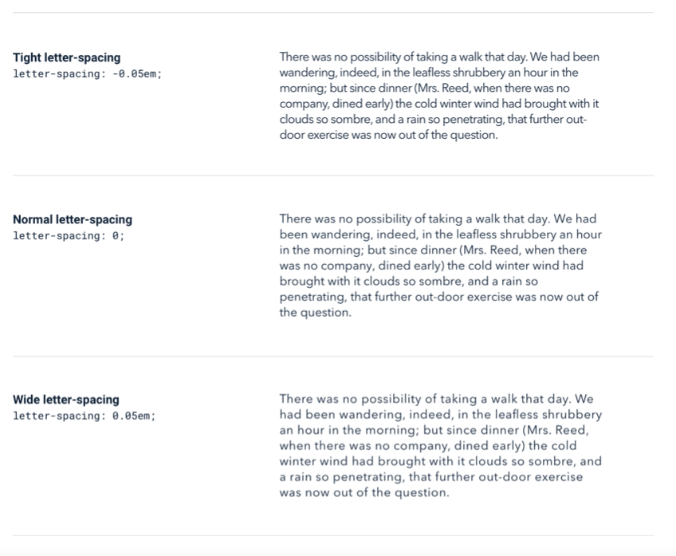

As a general rule, you should trust the typeface designer and leave letter- spacing alone. That said, there are a couple of common situations where adjusting it can improve your designs.

### Tightening headlines

When someone designs a font family, they design it with a purpose in mind.

A family like Open Sans is designed to be highly legible even at small sizes, so the built-in letter-spacing is a lot wider than a family like Oswald which is designed for headlines.

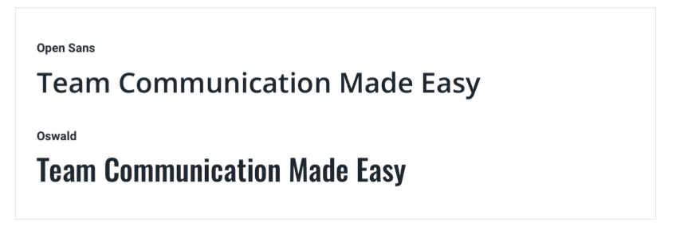

If you want to use a family with wider letter-spacing for headlines or titles, it can often make sense to decrease the letter-spacing to mimic the condensed look of a purpose-built headline family:


Avoid trying to make this work the other way around though — headline fonts rarely work well at small sizes even if you increase the letter spacing.

### Improving all-caps legibility

The letter-spacing in most font families is optimized for normal “sentence case” text — a capital letter followed by mostly lowercase letters.

Lowercase letters have a lot of variety visually. Letters like n, v, and e fit entirely within a typeface’s x-height, other letters like y, g, and p have descenders that poke out below the baseline, and letters like b, f, and t have ascenders that extend above.


All-caps text on the other hand isn’t so diverse. Since every letter is the same height, using the default letter-spacing often leads to text that is harder to read because there are fewer distinguishing characteristics between letters.

For that reason, it often makes sense to increase the letter-spacing of all- caps text to improve readability:

