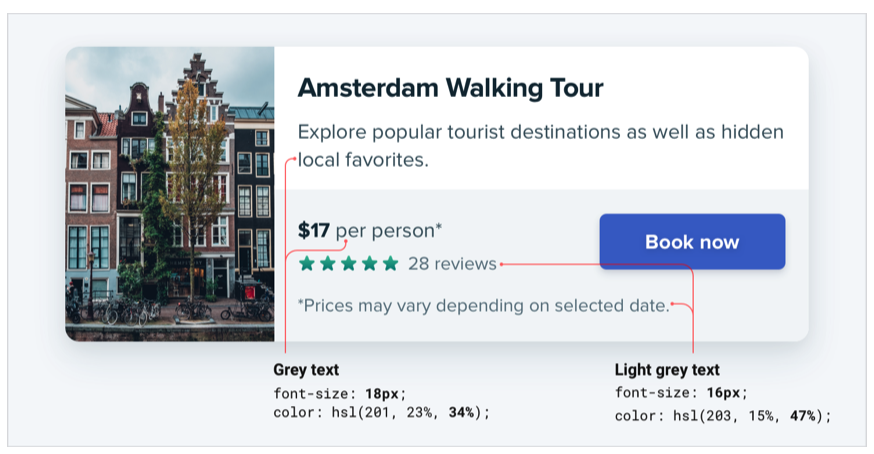
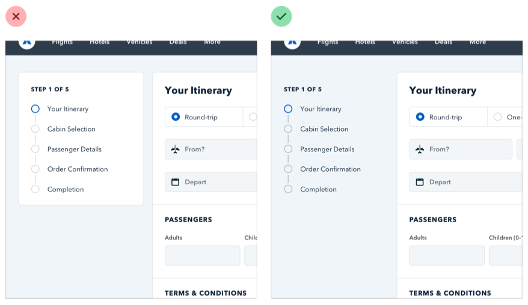
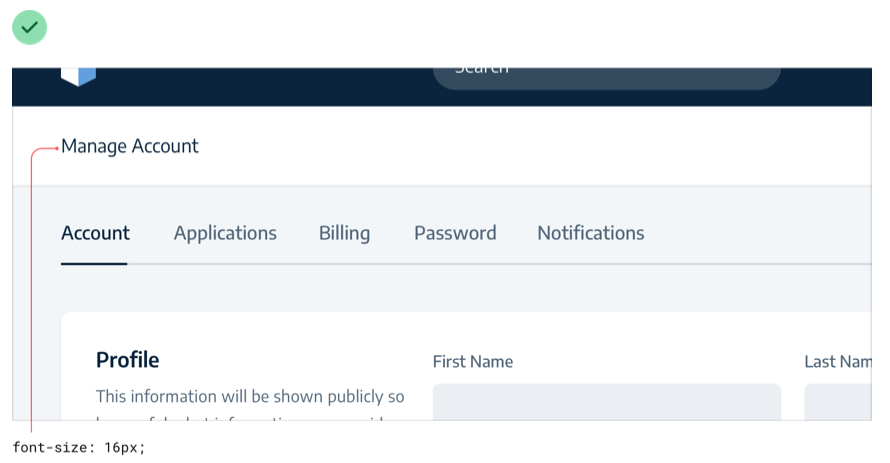
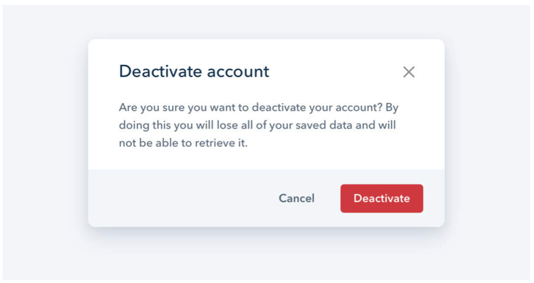

## Not all elements are equal

When you think of visual design as “styling things so they look good”, it’s easy to see why it might feel hard to achieve without innate artistic talent. But it turns out that one of the biggest factors in making something “look good” has nothing to do with superficial styling at all.

Visual hierarchy refers to how important the elements in an interface appear in relation to one another, and it’s the most effective tool you have for making something feel “designed”.

When everything in an interface is competing for attention, it feels noisy and chaotic, like one big wall of content where it’s not clear what actually matters:

When you deliberately de-emphasize secondary and tertiary information, and make an effort to highlight the elements that are most important, the result is immediately more pleasing, even though the color scheme, font choice, and layout haven’t changed:

So how do you actually make this happen? In the following chapters, we’ll cover a number of specific strategies you can use to introduce hierarchy into your designs.

## Size isn’t everything

Relying too much on font size to control your hierarchy is a mistake — it often leads to primary content that’s too large, and secondary content that’s too small.

Instead of leaving all of the heavy lifting to font size alone, try using font weight or color to do the same job.

For example, making a primary element bolder lets you use a more reasonable font size, and often does a better job at communicating its importance anyways:

Similarly, using a softer color for supporting text instead of a tiny font size makes it clear that the text is secondary while sacrificing less on readability:

Try and stick to two or three colors:

- A dark color for primary content (like the headline of an article)
- A grey for secondary content (like the date an article was published)
- A lighter grey for tertiary content (maybe the copyright notice in a footer)

Similarly, two font weights are usually enough for UI work:

- A normal font weight (400 or 500 depending on the font) for most text
- A heavier font weight (600 or 700) for text you want to emphasize

Stay away from font weights under 400 for UI work — they can work for large headings but are too hard to read at smaller sizes. If you’re considering using a lighter weight to de-emphasize some text, use a lighter color or smaller font size instead.

## Don’t use grey text on colored backgrounds

Making text a lighter grey is a great way to de-emphasize it on white backgrounds, but it doesn’t look so great on colored backgrounds.

That’s because the effect we’re actually seeing with grey on white is reduced contrast.

Making the text closer to the background color is what actually helps create hierarchy, not making it light grey.

You might think that the easiest way to achieve this is to use white text and reduce the opacity:

While this does reduce the contrast, it often results in text that looks dull, washed out, and sometimes even disabled.

Even worse, using this approach on top of an image or pattern means the background will show through the text:

A better approach is to hand-pick a new color, based on the background color.

Choose a color with the same hue, and adjust the saturation and lightness until it looks right to you:

Hand-picking a color this way makes it easy to reduce the contrast without the text looking faded.

## Emphasize by de-emphasizing

Sometimes you’ll run into a situation where the main element of an interface isn’t standing out enough, but there’s nothing you can add to it to give it the emphasis it needs.

For example, despite trying to make this active nav item “pop” by giving it a different color, it still doesn’t really stand out compared to the inactive items:

When you run into situations like this, instead of trying to further emphasize the element you want to draw attention to, figure out how you can de- emphasize the elements that are competing with it.

In this example, you could do that by giving the inactive items a softer color so they sit more in the background:

You can apply this thinking to bigger pieces of an interface as well. For example, if a sidebar feels like it’s competing with your main content area, don’t give it a background color — let the content sit directly on the page background instead:

## Labels are a last resort

Put down the accessibility pitchfork — this isn’t about forms.

When presenting data to the user (especially data from the database), it’s
easy to fall into the trap of displaying it using a naive label: value format.

The problem with this approach is that it makes it difficult to present the data with any sort of hierarchy; every piece of data is given equal emphasis.

### You might not need a label at all

In a lot of situations, you can tell what a piece of data is just by looking at the format.

For example, janedoe@example.com is an email address, (555) 765-4321 is a phone number and $19.99 is a price.

When the format isn’t enough, the context often is. When you see the phrase “Customer Support” listed below someone’s name in an employee directory, you don’t need a label to make the connection that that is the department the person works in.

When you’re able to present data without labels, it’s much easier to emphasize important or identifying information, making the interface easier to use while at the same time making it feel more “designed”.

### Combine labels and values

Even when a piece of data isn’t completely clear without a label, you can often avoid adding a label by adding clarifying text to the value.

For example, if you need to display inventory in an e-commerce interface, instead of “In stock: 12”, try something like “12 left in stock”.

If you’re building a real estate app, something like “Bedrooms: 3” could simply become “3 bedrooms”.

When you’re able to combine labels and values into a single unit, it’s much easier to give each piece of data meaningful styling without sacrificing on clarity.

### Labels are secondary

Sometimes you really do need a label; for example when you’re displaying multiple pieces of similar data and they need to be easily scannable, like on a dashboard.

In these situations, add the label, but treat it as supporting content. The data itself is what matters, the label is just there for clarity.

De-emphasize the label by making it smaller, reducing the contrast, using a lighter font weight, or some combination of all three.

### When to emphasize a label

If you’re designing an interface where you know the user will be looking for the label, it might make sense to emphasize the label instead of the data.

This is often the case on information-dense pages, like the technical specifications of a product.

If a user is trying to find out the dimensions of a smartphone, they’re probably scanning the page for words like “depth”, not “7.6mm”.

Don’t de-emphasize the data too much in these scenarios; it’s still important information. Simply using a darker color for the label and a slightly lighter color for the value is often enough.

## Separate visual hierarchy from document hierarchy

It’s important to use semantic markup when building for the web, which means you’ll often be using heading tags like h1, h2, or h3 if you decide to add a title to part of an interface.

By default, web browsers assign progressively smaller font sizes to heading elements, so an h1 is pretty large, and an h6 is pretty small. This can be helpful for document-style content like articles or documentation, but it can encourage some bad decisions in application UIs.

Using an h1 tag to add a title like Manage Account to a page makes perfect sense semantically, but because we’re trained to believe that h1 elements should be big, it’s easy to fall into the trap of making those titles bigger than they really need to be.

A lot of the time, section titles act more like labels than headings — they are supportive content, they shouldn’t be stealing all the attention.

Usually the content in that section should be the focus, not the title. That means that a lot of the time, titles should actually be pretty small:

Taken to the extreme, you might even include section titles in your markup for accessibility reasons but completely hide them visually because the content speaks for itself.

Don’t let the element you’re using influence how you choose to style it — pick elements for semantic purposes and style them however you need to create the best visual hierarchy.

## Balance weight and contrast

The reason bold text feels emphasized compared to regular text is that bold text covers more surface area — in the same amount of space, more pixels are used for text than for the background.

So why is this interesting? Well it turns out that the relationship between surface area and hierarchy has implications on other elements in a UI as well.

### Using contrast to compensate for weight

One of the places understanding this relationship becomes important is when working with icons.

Just like bold text, icons (especially solid ones) are generally pretty “heavy” and cover a lot of surface area. As a result, when you put an icon next to some text, the icon tends to feel emphasized.

Unlike text, there’s no way to change the “weight” of an icon, so to create balance it needs to be de-emphasized in some other way.

A simple and effective way to do this is to lower the contrast of the icon by giving it a softer color.

This works anywhere you need to balance elements that have different weights. Reducing the contrast works like a counterbalance, making heavier elements feel lighter even though the weight hasn’t changed.

### Using weight to compensate for contrast

Just like how reducing contrast helps to de-emphasize heavy elements, increasing weight is a great way to add a bit of emphasis to low contrast elements.

This is useful when things like thin 1px borders are too subtle using a soft color, but darkening the color makes the design feel harsh and noisy.

Making the border a bit heavier by increasing the width helps to emphasize it without losing the softer look:

## Semantics are secondary

When there are multiple actions a user can take on a page, it’s easy to fall into the trap of designing those actions based purely on semantics.

Semantics are an important part of button design, but that doesn’t mean you can forget about hierarchy.

Every action on a page sits somewhere in a pyramid of importance. Most pages only have one true primary action, a couple of less important secondary actions, and a few seldom used tertiary actions.

When designing these actions, it’s important to communicate their place in the hierarchy.

- **Primary actions should be obvious.** Solid, high contrast background colors work great here.
- **Secondary actions should be clear but not prominent.** Outline styles or lower contrast background colors are great options.
- **Tertiary actions should be discoverable but unobtrusive.** Styling these actions like links is usually the best approach.

When you take a hierarchy-first approach to designing the actions on page, the result is a much less busy UI that communicates more clearly:

### Destructive actions

Being destructive or high severity doesn’t automatically mean a button should be big, red, and bold.

If a destructive action isn’t the primary action on the page, it might be better to give it a secondary or tertiary button treatment.

Combine this with a confirmation step where the destructive action actually is the primary action, and apply the big, red, bold styling there.

