## Start with too much white space

One of the easiest ways to clean up a design is to simply give every element a little more room to breathe.

Sounds simple enough, right? So how come we don’t usually do it?

### White space should be removed, not added

When designing for the web, white space is almost always added to a design — if something looks little too cramped, you add a bit of margin or padding until things look better.

A better approach is to start by giving something way too much space, then remove it until you’re happy with the result.

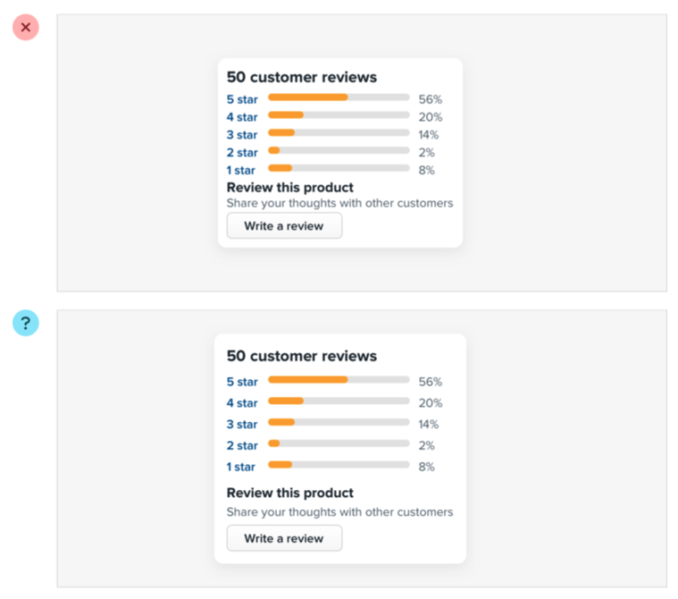

The problem with this approach is that elements are only given the minimum amount of breathing room necessary to not look actively bad. To make something actually look great, you usually need more white space.

You might think you’d end up with too much white space this way, but in practice, what might seem like “a little too much” when focused on an individual element ends up being closer to “just enough” in the context of a complete UI.

### Dense UIs have their place

While interfaces with a lot of breathing room almost always feel cleaner and simpler, there are certainly situations where it makes sense for a design to be much more compact.

For example, if you’re designing some sort of dashboard where a lot of information needs to be visible at once, packing that information together so it all fits on one screen might be worth making the design feel more busy.

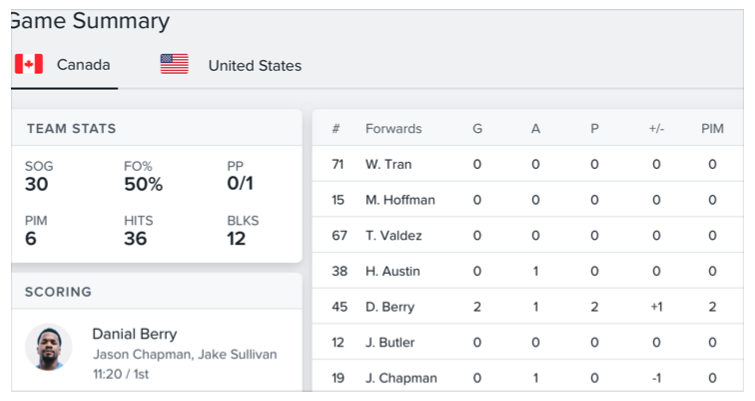

The important thing is to make this a deliberate decision instead of just being the default. It’s a lot more obvious when you need to remove white space than it is when you need to add it.

## Establish a spacing and sizing system

You shouldn’t be nitpicking between 120px and 125px when trying to decide on the perfect size for an element in your UI.

Painfully trialing arbitrary values one pixel at a time will drastically slow you down at best, and create ugly, inconsistent designs at worst.

Instead, limit yourself to a constrained set of values, defined in advance.

### A linear scale won’t work

Creating a spacing and sizing system isn’t quite as simple as something like “make sure everything is a multiple of 4px” — a naive approach like that doesn’t make it any easier to choose between 120px and 125px.

For a system to be truly useful, it needs to take into consideration the relative difference between adjacent values.

At the small end of the scale (like the size of an icon, or the padding inside a button), a couple of pixels can make a big difference. Jumping from 12px to 16px is an increase of 33%!

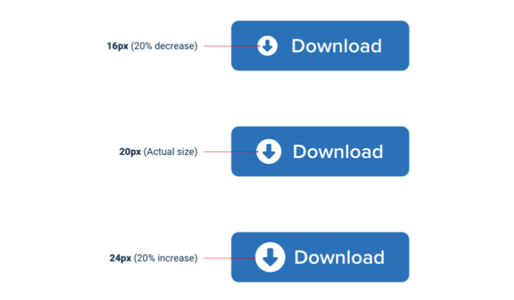

But at the large end (the width of a card, or the vertical spacing in a landing page hero), a couple of pixels is basically imperceivable. Even increasing the width of a card from 500px to 520px is only a difference of 4%, which is eight times less significant than the jump from 12px to 16px.

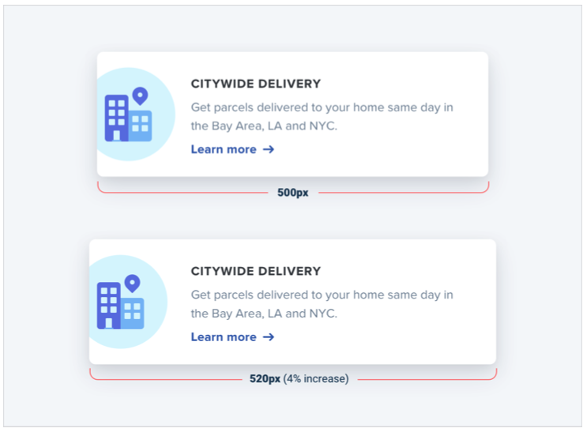

If you want your system to make sizing decisions easy, make sure no two values in your scale are ever closer than about 25%.

### Defining the system

Just like you don’t want to toil over arbitrary values when sizing an element or fine-tuning the space between elements, you don’t want to build your spacing and sizing scale from arbitrary values either.

A simple approach is to start with a sensible base value, then build a scale using factors and multiples of that value.

16px is a great number to start with because it divides nicely, and also happens to be the default font size in every major web browser.

The values at the small end of the scale should start pretty packed together, and get progressively more spaced apart as you get further up the scale.

Here’s an example of a fairly practical scale built using this approach:

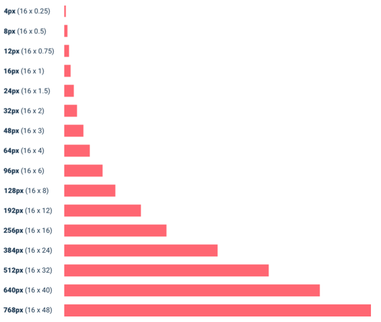

### Using the system

Once you’ve defined your spacing and sizing system, you’ll find that you’re able to design a hell of a lot faster, especially if you design in the browser (sticking to a system is easier when you’re typing in numbers than when you’re dragging with the mouse.)

Need to add some space under an element? Grab a value from your scale and try it out. Not quite enough? The next value is probably perfect.

While the workflow improvements are probably the biggest benefit, you’ll also start to notice a subtle consistency in your designs that wasn’t there before, and things will look just a little bit cleaner.

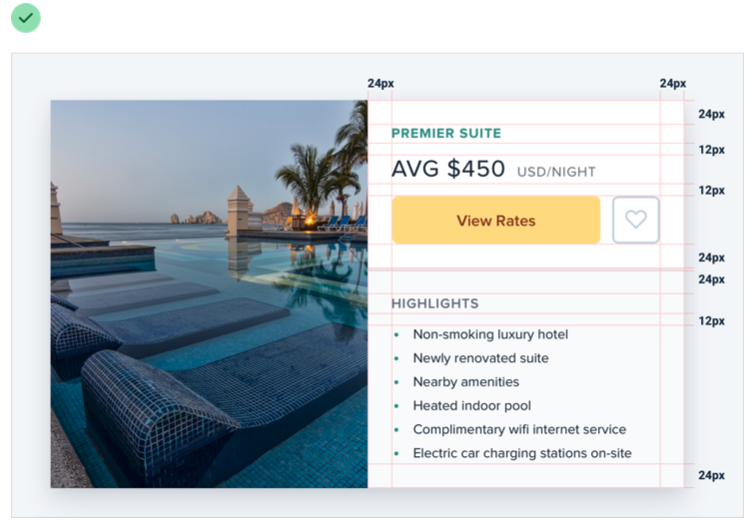

A spacing and sizing system will help you create better designs, with less effort, in less time. Design advice doesn’t get much more valuable than that.

## You don’t have to fill the whole screen

Remember when 960px was the de facto layout width for desktop-size designs? These days you’d be hard-pressed to find a phone with a resolution that low.

So it’s no surprise that when most of us open our design tool of choice on our high resolution displays, we give ourselves at least 1200-1400px of space to fill. But just because you have the space, doesn’t mean you need to use it.

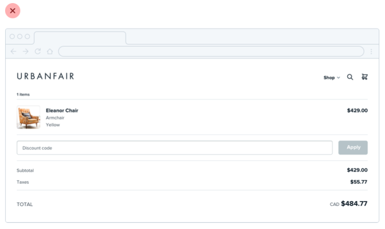

If you only need 600px, use 600px. Spreading things out or making things unnecessarily wide just makes an interface harder to interpret, while a little extra space around the edges never hurt anyone.

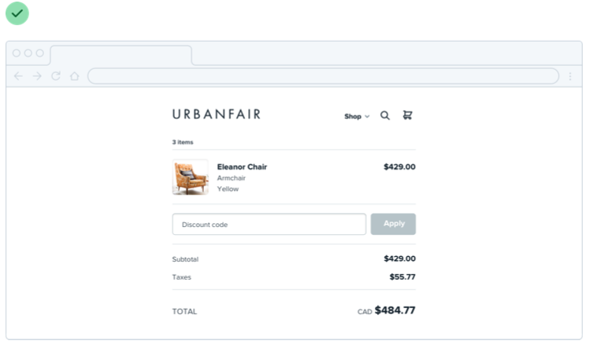

This is just as applicable to individual sections of an interface, too. You don’t need to make everything full-width just because something else (like your navigation) is full-width.

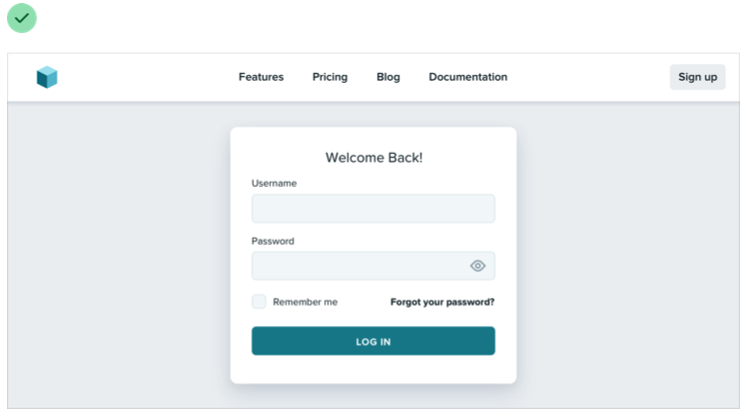

Give each element just the space it needs — don’t make something worse just to make it match something else.

### Shrink the canvas

If you’re having a hard time designing a small interface on a large canvas, shrink the canvas! A lot of the time it’s easier to design something small when the constraints are real.

If you’re building a responsive web application, try starting with a ~400px canvas and designing the mobile layout first.

Once you have a mobile design you’re happy with, bring it over to a larger size screen and adjust anything that felt like a compromise on smaller screens. Odds are you won’t have to change as much as you think.

### Thinking in columns

If you’re designing something that works best at a narrower width but feels unbalanced in the context of an otherwise wide UI, see if you can split it into columns instead of just making it wider.

For example, take this narrow form layout:

If you wanted to make better use of the available space without making the form harder to use, you could break the supporting text out into a separate column:

This makes the design feel more balanced and consistent without compromising on the optimal width for the form itself.

### Don’t force it

Just like you shouldn’t worry about filling the whole screen, you shouldn’t try to cram everything into a small area unnecessarily either.

If you need a lot of space, go for it! Just don’t feel obligated to fill it if you don’t have to.

## Grids are overrated

Using a system like a 12-column grid is a great way to simplify layout decisions, and can bring a satisfying sense of order to your designs.

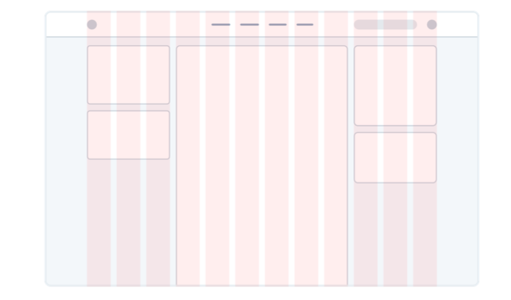

But even though grids can be useful, outsourcing all of your layout decisions to a grid can do more harm than good.

### Not all elements should be fluid

Fundamentally, a grid system is just about giving elements fluid, percentage- based widths, where you’re choosing from a constrained set of percentages.

For example, in a 12-column grid each column is 8.33% wide. As long as an element’s width is some multiple of 8.33% (including any gutters), that element is “on the grid”.

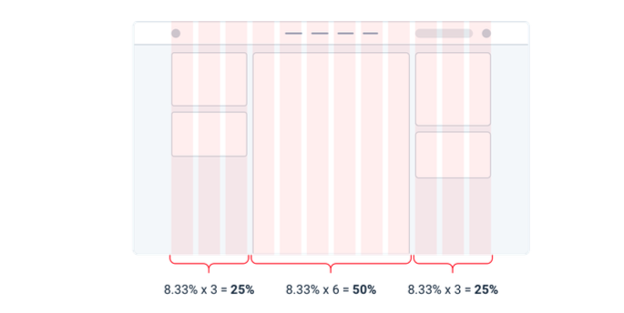

The problem with treating grid systems like a religion is that there are a lot of situations where it makes much more sense for an element to have a fixed width instead of a relative width.

For example, consider a traditional sidebar layout. Using a 12-column grid system, you might give the sidebar a width of three columns (25%) and the main content area a width of nine columns (75%).

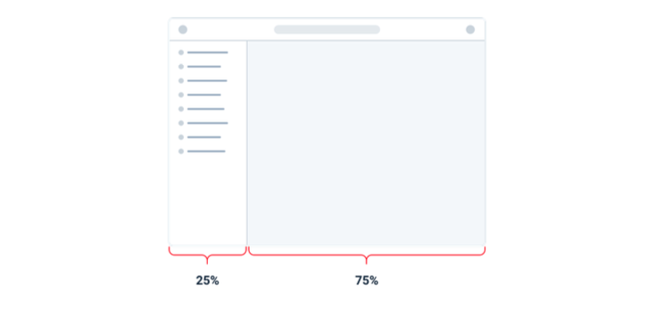

This might seem fine at first, but think about what happens when you resize the screen.

If you make the screen wider the sidebar gets wider too, taking up space that could’ve been put to better use by the main content area.

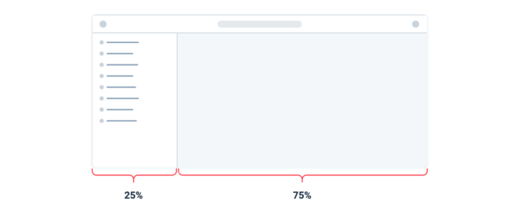

Similarly, if you make the screen narrower, the sidebar can shrink below its minimum reasonable width, causing awkward text wrapping or truncation.

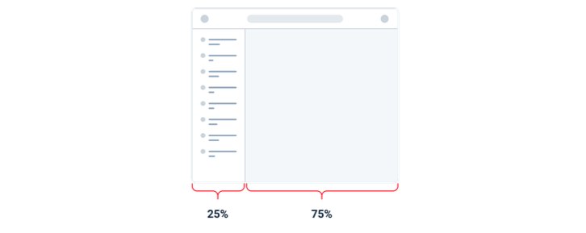

In this situation, it makes much more sense to give the sidebar a fixed width that’s optimized for its contents. The main content area can then flex to fill the remaining space, using its own internal grid to lay out its children.

This applies within components, too — don’t use percentages to size something unless you actually want it to scale.

### Don’t shrink an element until you need to

Say you’re designing a login card. Using the full screen width would look ugly, so you give it a width of 6 columns (50%) with a 3-column offset on each side.

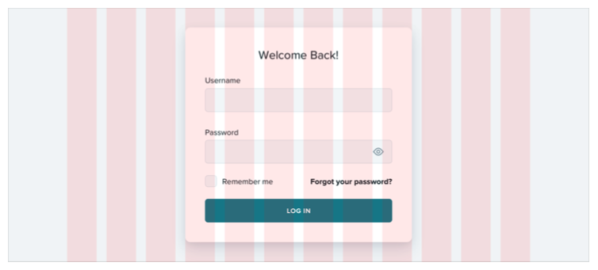

On medium-sized screens you realize the card is a little narrow even though you have the space to make it bigger, so at that screen size you switch it to a width of 8 columns, with two empty columns on each side.

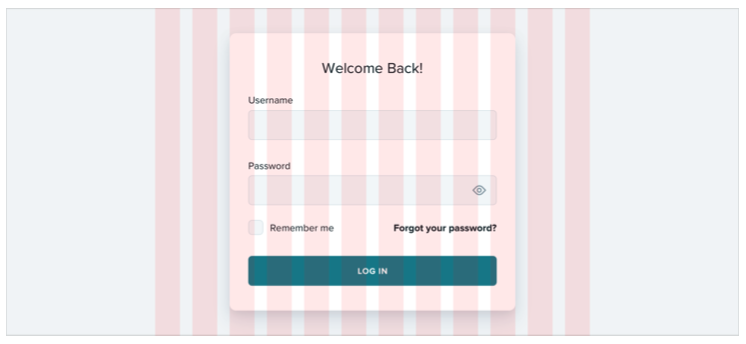

The silly thing about this approach is that because column widths are fluid, there’s a range in screen sizes where the login card is wider on medium screens than it is on large screens:

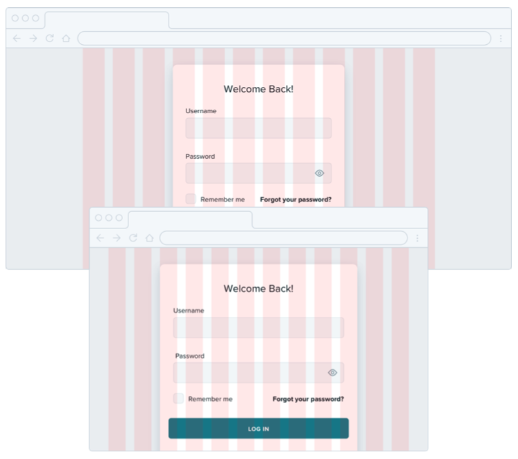

If you know that say 500px is the optimal size for the card, why should it ever get smaller than that if you have the space for it?

Instead of sizing elements like this based on a grid, give them a max-width so they don’t get too large, and only force them to shrink when the screen gets smaller than that max-width.

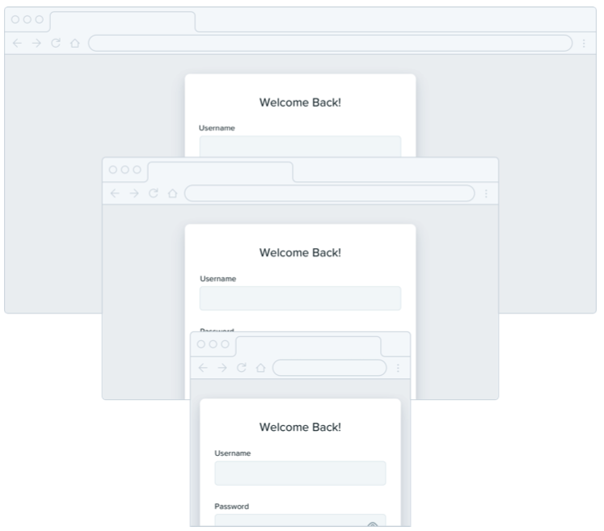

Don’t be a slave to the grid — give your components the space they need and don’t make any compromises until it’s actually necessary.

## Relative sizing doesn’t scale

It’s tempting to believe that every part of an interface should be sized relative to one another, and that if element A needs to shrink by 25% on smaller screens, that element B should shrink by 25%, too.

For example, say you’re designing an article at a large screen size. If your body copy is 18px and your headlines are 45px, it’s tempting to encode that relationship by defining your headline size as 2.5em; 2.5 times the current font size.

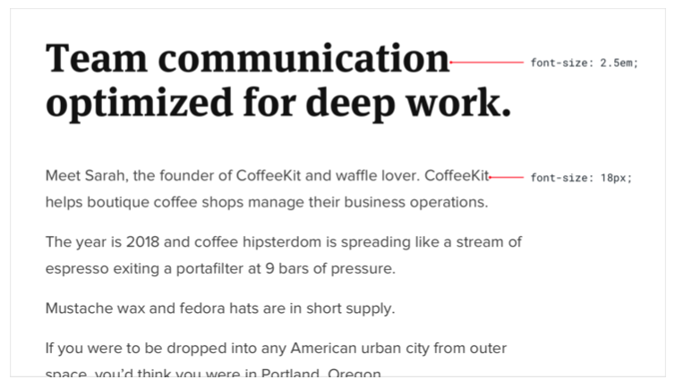

There’s nothing inherently wrong with using relative units like em, but don’t be fooled into believing that relationships defined this way can remain static — 2.5em might be the perfect headline size on desktop but there’s no guarantee that it’ll be the right size on smaller screens.

Say you reduce the size of your body copy to 14px on small screens to keep the line length in check. Keeping your headlines at 2.5em means a rendered font size of 35px — way too big for a small screen!

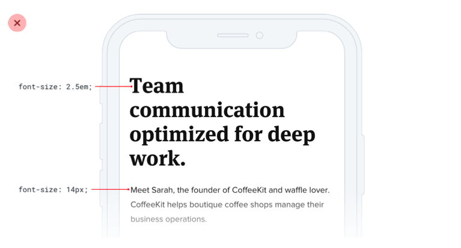

A better headline size for small screens might be somewhere between 20px and 24px:

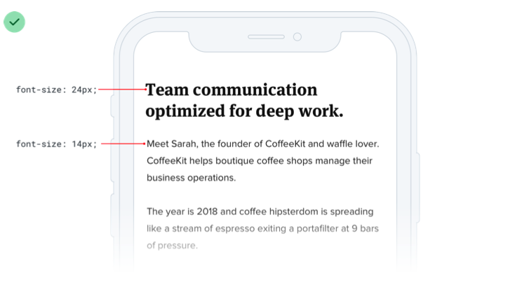

That’s only 1.5-1.7x the size of the 14px body copy — a totally different relationship than what made sense on desktop screens. That means there isn’t any real relationship at all, and that there’s no real benefit in trying to define the headline size relative to the body copy size.

As a general rule, elements that are large on large screens need to shrink faster than elements that are already fairly small — the difference between small elements and large elements should be less extreme at small screen sizes.

### Relationships within elements

The idea that things should scale independently doesn’t just apply to sizing elements at different screen sizes; it applies to the properties of a single component, too.

Say you’ve designed a button. It’s got a 16px font size, 16px of horizontal padding, and 12px of vertical padding:

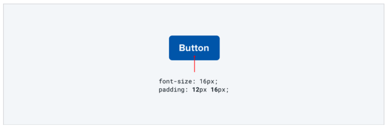

Much like the previous example, it’s tempting to think that the padding should be defined in terms of the current font size. That way if you want a larger or smaller button, you only need to change the font size and the padding will update automatically, right?

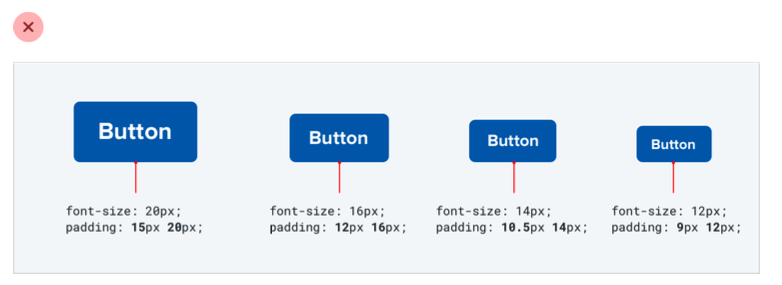

This works — the buttons do scale up or down and preserve the same proportions. But is that what we really want?

Compare that to these buttons, where the padding gets more generous at larger sizes and disproportionately tighter at smaller sizes:

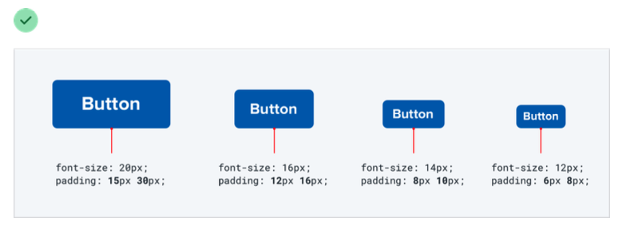

Here the large button actually feels like a larger button, and the small buttons actually feel like smaller buttons, not like we simply adjusted the zoom.

Let go of the idea that everything needs to scale proportionately — giving yourself the freedom to fine-tune things independently makes it a hell of a lot easier to design for multiple contexts.

## Avoid ambiguous spacing

When groups of elements are explicitly separated — usually by a border or background color — it’s obvious which elements belong to which group.

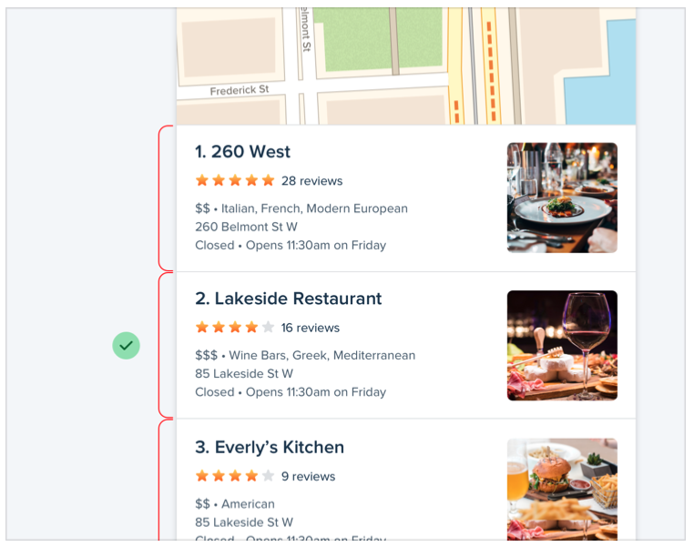

But when there isn’t a visible separator, it’s not always so obvious.

Say you’re designing a form with stacked labels and inputs. If the margin below the label is the same as the margin below the input, the elements in the form group won’t feel obviously “connected”.

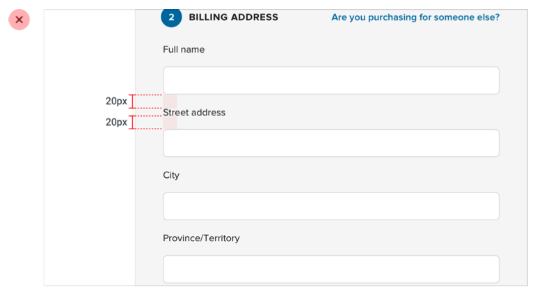

At best the user has to work harder to interpret the UI, and at worst it means accidentally putting the wrong data in the wrong field.

The fix is to increase the space between each form group so it’s clear which label belongs to which input:

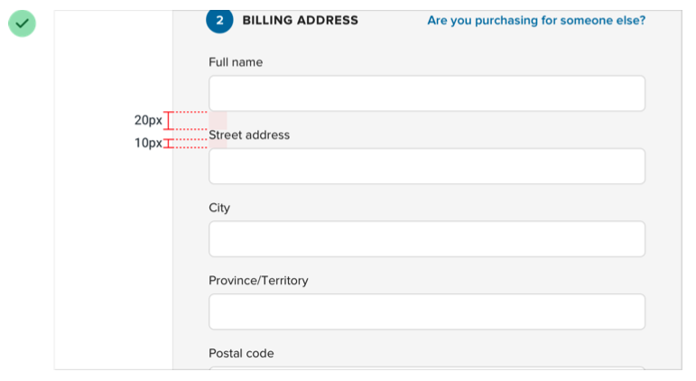

This same problem shows up in article design when there’s not enough space above section headings:

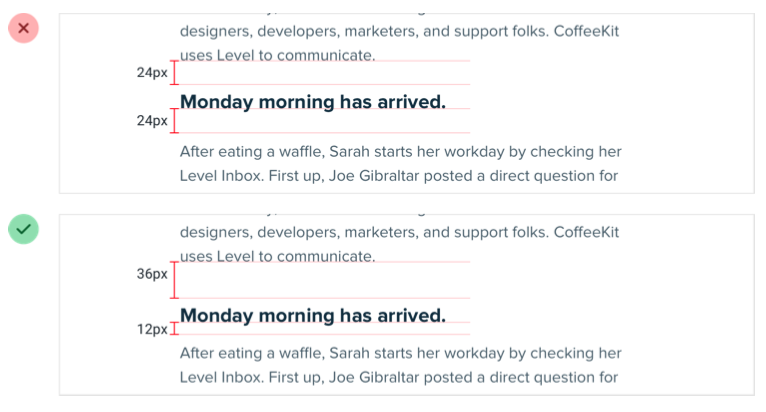

...and in bulleted lists, when the space between bullets matches the line- height of a single bullet:

It’s not just vertical spacing that you have to worry about either; it’s easy to make this mistake with components that are laid out horizontally, too:

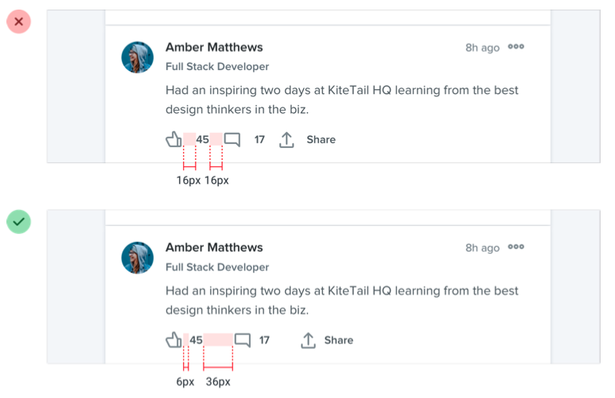

Whenever you’re relying on spacing to connect a group of elements, always make sure there’s more space around the group than there is within it — interfaces that are hard to understand always look worse.