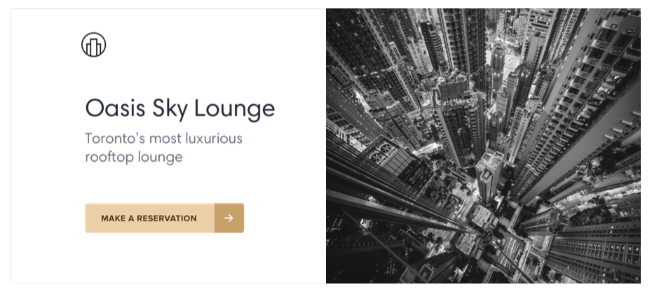

## Start with a feature, not a layout

When you start the design for a new app idea, what do you design first? If it’s the navigation bar at the top of the page, you’re making a mistake.

The easiest way to find yourself frustrated and stuck when working on a new design is to start by trying to “design the app.” When most people think about “designing the app”, they’re thinking about the shell.

Should it have a top nav, or a sidebar?

Should the navigation items be on the left, or on the right?

Should the page content be in a container, or should it be full-width?

Where should the logo go?

The thing is, an “app” is actually a collection of features. Before you’ve designed a few features, you don’t even have the information you need to make a decision about how the navigation should work. No wonder it’s frustrating!

Instead of starting with the shell, start with a piece of actual functionality.

For example, say you’re building a flight booking service. You could start with a feature like “searching for a flight”.

Your interface will need:

- A field for the departure city
- A field for the destination city
- A field for the departure date
- A field for the return date
- A button to perform the search

Start with that.

Hell, you might not even need that other stuff anyways — it worked for Google.

## Detail comes later

In the earliest stages of designing a new feature, it’s important that you don’t get hung up making low-level decisions about things like typefaces, shadows, icons, etc.

That stuff will all matter eventually, but it doesn’t matter right now.

If you have trouble ignoring the details when working in a high fidelity environment like the browser or your favorite design tool, one trick Jason Fried of Basecamp likes to use is to design on paper using a thick Sharpie.

Obsessing over little details just isn’t possible with a Sharpie, so it can be a great way to quickly explore a bunch of different layout ideas.

### Hold the color

Even when you’re ready to refine an idea in higher fidelity, resist the temptation to introduce color right away.

By designing in grayscale, you’re forced to use spacing, contrast, and size to do all of the heavy lifting.

It’s a little more challenging, but you’ll end up with a clearer interface with a strong hierarchy that’s easy to enhance with color later.

### Don’t over-invest

The whole point of designing in low-fidelity is to be able to move fast, so you can start building the real thing as soon as possible.

Sketches and wireframes are disposable — users can’t do anything with static mockups. Use them to explore your ideas, and leave them behind when you’ve made a decision.

## Don’t design too much

You don’t need to design every single feature in an app before you move on to implementation; in fact, it’s better if you don’t.

Figuring out how every feature in a product should interact and how every edge case should look is really hard, especially in the abstract.

How should this screen look if the user has 2000 contacts?

Where should the error message go in this form?

How should this calendar look when there are two events scheduled at the same time?

You’re setting yourself up for frustration by trying to figure this stuff out using only a design tool and your imagination.

### Work in cycles

Instead of designing everything up front, work in short cycles. Start by designing a simple version of the next feature you want to build.

Once you’re happy with the basic design, make it real.

You’ll probably run into some unexpected complexity along the way, but that’s the point — it’s a lot easier to fix design problems in an interface you can actually use than it is to imagine every edge case in advance.

Iterate on the working design until there are no more problems left to solve, then jump back into design mode and start working on the next feature.

### Be a pessimist

Don’t imply functionality in your designs that you aren’t ready to build.

For example, say you’re working on a comment system for a project management tool. You know that one day, you’d like users to be able to attach files to their comments, so you include an attachments section in your design.

You get deep into implementation only to discover that supporting attachments is going to be a lot more work than you anticipated. There’s no way you have time to finish it right now, so the whole commenting system sits on the backburner while you take care of other priorities.

The thing is, a comment system with no attachments would still have been better than no comment system at all, but because you planned to include it from day one you’ve got nothing you can ship.

When you’re designing a new feature, **expect it to be hard to build**. Designing the smallest useful version you can ship reduces that risk considerably.

If part of a feature is a “nice-to-have”, **design it later**. Build the simple version first and you’ll always have something to fall back on.

## Choose a personality

Every design has some sort of personality. A banking site might try to communicate secure and professional, while a trendy new startup might have a design that feels fun and playful.

On the surface, giving a design a particular personality might sound abstract and handwavy, but a lot of it is determined by a few solid, concrete factors.

### Font choice

Typography plays a huge part in determining how a design feels.

If you want an elegant or classic look, you might want to incorporate a serif typeface in your design:

For a playful look, you could use a rounded sans serif:

If you’re going for a plainer look, or want to rely on other elements to provide the personality, a neutral sans serif works great:

### Color

There’s a lot of science out there on the psychology of color, but in practice, you really just need to pay attention to how different colors feel to you.

Blue is safe and familiar — nobody ever complains about blue:

Gold might say “expensive” and “sophisticated”:

Pink is a bit more fun, and not so serious:

While trying to choose colors using only psychology isn’t super practical — a lot of it is just about what looks good to you — it can be helpful to think about when you’re trying to understand why you think a color is the right fit.

### Border radius

As small of a detail as it sounds, if and how much you round the corners in your design can have a big impact on the overall feel.

A small border radius is pretty neutral, and doesn’t really communicate much of a personality on its own:

A large border radius starts to feel more playful:

...while no border radius at all feels a lot more serious or formal:

Whatever you choose, it’s important to stay consistent. Mixing square corners with rounded corners in the same interface almost always looks worse than sticking with one or the other.

### Language

While not a visual design technique per se, the words you use in an interface have a massive influence on the overall personality.

Using a less personal tone might feel more official or professional:

...while using friendlier, more casual language makes a site feel, well, friendlier:

Words are everywhere in a user interface, and choosing the right ones is just as (if not more) important than choosing the right color or typeface.

### Deciding what you actually want

A lot of the time you’ll probably just have a gut feeling for the personality you’re going for. But if you don’t, a great way to simplify the decision is to take a look at other sites used by the people you want to reach.

If they are mostly pretty “serious business”, maybe that’s how your site should look too. If they are more playful with a bit of humor, maybe that’s a better direction to take.

Just try not to borrow too much from direct competitors, you don’t want to look like a second-rate version of something else.

## Limit your choices

Having millions of colors and thousands of fonts to choose from might sound nice in theory, but in practice it’s usually a paralyzing curse.

And it’s not just fonts and colors, either — you can easily waste time agonizing over almost any minor design decision.

Should this text be 12px or 13px?

Should this box shadow have a 10% opacity or a 15% opacity?

Should this avatar be 24px or 25px tall?

Should I use a medium font weight for this button or semibold?

Should this headline have a bottom margin of 18px or 20px?

When you’re designing without constraints, decision-making is torture because there’s always going to be more than one right choice.

For example, these buttons all have different background colors, but it’s almost impossible to tell the difference between them by just looking at them.

How are you supposed to make a confident decision if none of these would really be bad choices?

### Define systems in advance

Instead of hand-picking values from a limitless pool any time you need to make a decision, start with a smaller set of options.

Don’t reach for the color picker every time you need to pick a new shade of blue — choose from a set of 8-10 shades picked out ahead of time.

Similarly, don’t tweak a font size one pixel at a time until it looks perfect. Define a restrictive type scale in advance and use that to make any future font size decisions.

When you build systems like this, you only have to do the hard work of picking the initial values once instead of every time you’re designing a new piece of UI. It’s a bit more work up front, but it’s worth it — it’ll save you a ton of decision fatigue down the road.

### Designing by process of elimination

When you’re designing using a constrained set of values, decision-making is a lot easier because there are a lot fewer “right” choices.

For example, say you’re trying to choose a size for an icon. You’ve defined a sizing scale in advance where your only small-to-medium sized options are 12px, 16px, 24px, and 32px.

To pick the best option, start by taking a guess at which one will look best, maybe 16px. Then try the values on either side (12px and 24px) for comparison.

Chances are, two of those options will seem like obviously bad choices. If it’s the options on the outside, you’re done — the middle option is the only good choice.

If one of the outer options looks best, do another comparison using that option as the “middle” value and make sure there’s not a better choice.

This approach works for anything where you’ve defined a system. When you’re limited to a set of options that all look noticeably different, picking the best one is a piece of cake.

### Systematize everything

The more systems you have in place, the faster you’ll be able to work and the less you’ll second guess your own decisions.

You’ll want systems for things like:

- Font size
- Font weight
- Line height
- Color
- Margin
- Padding
- Width
- Height
- Box shadows
- Border radius
- Border width 
- Opacity

...and anything else you run into where it feels like you’re laboring over a low- level design decision.

You don’t have to define all of this stuff ahead of time, just make sure you’re approaching design with a system-focused mindset. Look for opportunities to introduce new systems as you make new decisions, and try to avoid having to make the same minor decision twice.

Designing with systems is going to be a recurring theme throughout this book, and in later chapters we’ll talk about building a lot of these systems in finer detail.