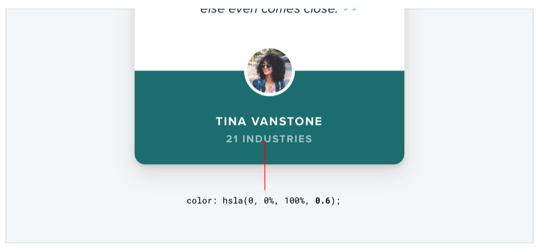

id: hierarchy-is-everything
title: 계층 구조가 모든 것이다
sidebar_label: 계층 구조가 모든 것이다
계층 구조는 페이지 내의 요소들이 어떻게 배열되고 서로 어떻게 연결되는지에 관한 개념입니다. 강력한 계층 구조는 시청자에게 길을 안내하고 페이지나 애플리케이션의 이해하기 쉽고 사용하기 쉬운 시각적 구조를 만듭니다. 이것은 크기 및 글꼴 차이, 색상과 대조, 공간과 배치 등 다양한 기법의 사용으로 달성됩니다. 계층 구조를 잘 정의하는 디자이너들은 사용자를 가장 중요한 요소에 초점을 맞추고 필요한 정보를 빠르게 찾는데 도움을 줄 수 있습니다.

## 모든 요소가 동등하지 않습니다

시각 디자인은 단지 예쁜 색상과 글꼴을 선택하는 것이 아닙니다. 또한, 사용자가 웹 사이트나 애플리케이션을 이해하고 탐색하는데 도움이 되는 명확하고 효과적인 레이아웃과 계층 구조를 만드는 것도 필요합니다. 다시 말해서, 좋은 시각 디자인은 물건이 좋아 보이는 것뿐만 아니라 이해하기 쉽고 사용자 친화적인 경험을 만드는 것입니다. 이는 타고난 예술적 재능이 없더라도, 명확하고 효과적인 시각적 구조를 만드는 데 집중함으로써 시각적으로 매력적인 디자인을 만들 수 있다는 것을 의미합니다.

디자인에서 시각적 계층 구조는 인터페이스 내의 요소들이 서로 어떻게 관련되어 있는지에 따라 얼마나 중요하게 보이는지를 나타내며, 무언가가 "좋아 보인다"는 느낌을 만드는데 사용하는 가장 효과적인 도구입니다.

인터페이스에서 모든 것이 주목을 받으려고 할 때, 컨텐츠가 서로 섞이고 중요한 것이 무엇인지 모호해지는 소음이 많고 혼란스러운 벽같은 느낌이 생깁니다.

시각적 계층 구조에 초점을 맞추면, 디자이너들은 색상 스킴, 글꼴 선택 또는 레이아웃을 변경하지 않고도 인터페이스를 더 부드럽고 깔끔하게 만들 수 있습니다. 이차적이고 삼차적인 정보의 강조를 줄이고 가장 중요한 요소를 강조함으로써, 디자이너들은 이해하기 쉽고 사용하기 쉬운 시각적 구조를 만들 수 있습니다. 이는 시청자의 눈을 안내하고 페이지 내의 콘텐츠를 이해하는데 도움이 됩니다. 이는 인터페이스를 더 시각적으로 매력적이고 사용자 친화적으로 만들 수 있지만, 전체 스타일은 변하지 않았을 수 있습니다.

디자인에서 강력한 시각적 계층 구조를 만드는 데 디자이너들은 다양한 전략과 기술을 사용할 수 있습니다. 이 전략 중 일부는 크기와 글꼴 차이를 사용하여 강조를 만들고, 중요한 요소를 강조하기 위해 색상과 대조를 사용하고, 시각적 구분과 계층 구조를 만들기 위해 공간을 사용하고, 사용자의 눈길을 이끌기 위해 배치를 사용하는 것을 포함할 수 있습니다. 이 전략들을 신중하게 계획하고 실행함으로써, 디자이너들은 이해하기 쉽고 사용하기 쉬운 시각적 구조를 만들 수 있습니다. 이는 사용자가 인터페이스를 이해하고 탐색하는 데 도움이 됩니다. 다음 섹션에서는 이 전략들을 더 자세히 살펴보고 실용적인 예를 제시할 것입니다.

## 크기는 모든 것이 아닙니다

계층 구조를 제어하기 위해 글꼴 크기에 과도하게 의존하는 것은 실수일 수 있습니다 - 왜냐하면 대체로 주요 컨텐츠는 너무 크고, 부차적인 컨텐츠는 너무 작기 때문입니다.

글꼴 크기만 사용하여 시각적 계층 구조를 만드는 대신, 디자이너들은 글꼴 무게나 색상 같은 기법을 사용하여 같은 효과를 얻을 수 있습니다. 예를 들어, 첫 번째 제목을 두 번째 제목보다 크게 만드는 대신, 첫 번째 제목에 더 두꺼운 글꼴 무게를 사용하여 더 도드라지게 만들 수 있습니다. 마찬가지로, 첫 번째 제목을 더 눈에 띄게 하기 위해 다른 색상을 사용할 수 있습니다.

예를 들어, 주요 항목을 더 두꺼게 만들면 보다 합리적인 글꼴 크기를 사용할 수 있게 되고, 일반적으로 중요성을 전달하는데 더 나은 일을 합니다.

보조 텍스트에 작은 글꼴 크기를 사용하는 대신, 디자이너들은 텍스트가 부차적인 중요성을 가지고 있다는 것을 보여주기 위해 더 부드러운 색상을 사용할 수 있습니다. 이는 사용자에게 텍스트가 주요 컨텐츠만큼 중요하지 않다는 것을 이해하는데 도움을 주지만, 여전히 읽을 수 있습니다.

두 개나 세 개의 색상에 머무르려고 노력하세요:

- 주요 컨텐츠에 대한 어두운 색상(예: 기사 제목).

- 부차적인 컨텐츠에 대한 회색(예: 기사 게시 날짜).

- 셋째로, 콘텐츠에 대한 더 연한 회색(아마도 footer의 저작권 주).

비슷하게, UI 작업에는 대체로 두 가지 글꼴 무게만 있으면 충분합니다:

- 대부분의 텍스트를 위한 일반적인 글꼴 무게(글꼴에 따라 400 또는 500).
- 강조하고자 하는 텍스트에 대한 더 무거운 글꼴 무게(600 또는 700).

UI 디자인에서는 400 이하의 폰트 무게를 피하십시오 - 큰 제목에는 적합하지만 작은 크기에서는 읽기 어렵습니다. 일부 텍스트를 강조하기 위해 더 가벼운 무게를 사용하려고 한다면, 대신 더 연한 색상이나 더 작은 글꼴 크기를 사용하십시오.

## 색상 배경에서 회색 텍스트를 사용하지 마십시오.

색상 배경에서 텍스트를 약간의 회색으로 채색하는 것은 흰색 배경에서 강조를 줄이는 데 좋은 방법이지만, 색상 배경에서는 잘 보이지 않습니다. 대신 배경 색상보다 몇 톤 더 밝거나 더 어두운 색상을 사용해 보거나, 강조와 계층 구조를 만들기 위해 다른 글꼴 크기나 무게를 사용하십시오.

이는 실제로 우리가 흰색 위에서 보는 효과의 대비를 줄이는 것을 의미합니다.

실제로 계층 구조를 만드는 것은 텍스트를 배경 색상에 가깝게 만드는 것이지, 그것을 연한 회색으로 만드는 것이 아닙니다.

 이 목표를 달성하는 가장 쉬운 방법은 아마도 흰색 텍스트를 사용하여 명암을 줄이는 것일 것이라고 생각할 수 있습니다:

이것은 대비를 줄이지만, 텍스트가 대체로 흐릿하게 보이고 때로는 차단되는 결과를 낳습니다.

더 나쁜 것은, 이 접근법을 이미지나 패턴 위에 사용하면, 텍스트가 배경으로 보이는 것을 의미합니다:

더 좋은 접근법은 배경 색상에 따라 수동으로 색상을 선택하는 것입니다.

같은 색조를 선택하고 정확도를 위해 채도와 밝기 값을 조정하십시오:

이렇게 수동으로 색상을 선택하면, 텍스트가 흐릿해 보이지 않게 대비를 쉽게 줄일 수 있습니다.

## 감소하여 강조하기

때때로 인터페이스의 주요 요소가 충분히 눈에 띄지 않는 상황에 직면할 수 있습니다, 하지만 당신이 추가로 강조할 수 있는 것이 없습니다.

예를 들어, 이 활성 탐색 요소를 다른 색상을 주어 강조하려고 했지만 그것은 여전히 수동 항목과 비교했을 때 정말로 눈에 띄지 않습니다:

이 문제를 해결하는 한 가지 방법은 다른 모든 항목에 대한 명암을 줄이는 것입니다:

이렇게 하면 탐색 요소가 더 강조되어 더 눈에 띄게 만듭니다.

이 같은 사고방식을 인터페이스의 더 큰 부분에도 적용할 수 있습니다. 예를 들어, 사이드바가 메인 컨텐츠 영역과 경쟁한다면 배경색을 주지 마세요 - 컨텐츠를 바로 페이지 배경에 남겨 두세요:

## 라벨은 마지막 수단입니다

접근성을 어렵게 만들지 마세요 — 이것은 폼에 대한 것이 아닙니다.

사용자에게 데이터를 제공할 때 (특히 데이터베이스에서 온 데이터인 경우), 데이터를 간단한 라벨 값 형식으로 표시하는 함정에 빠지기 쉽습니다.

이 접근법의 문제는, 각 데이터 조각에 동등한 강조를 두어 계층적 구조로 표시하는 것을 어렵게 만든다는 것입니다.

### 항상 라벨을 사용할 필요는 없습니다.

많은 경우에, 데이터의 형식을 보고 무엇인지 알 수 있습니다.

예를 들어, janedoe@example.com은 이메일 주소이고, (555) 765-4321은 전화번호이며, $19.99는 가격입니다.

형식만으로는 충분하지 않을 때, 문맥이 대체로 충분합니다. 직원 목록에서 어떤 사람의 이름 아래에 "고객 지원"이라는 문구를 보면, 그 사람이 어떤 부서에서 일하는지 연결을 위한 라벨이 필요하지 않습니다.

데이터를 라벨 없이 제공할 수 있을 때, 중요한 정보나 설명 정보를 강조하기가 훨씬 더 쉬워집니다, 이는 인터페이스를 더 쉽게 사용하게 만들면서 동시에 더 "디자인된" 느낌을 줍니다.

### 라벨과 값들을 결합하세요

데이터 조각이 라벨 없이 완전히 명확하지 않더라도, 값에 설명적인 텍스트를 추가하여 일반적으로 라벨을 추가하는 것을 방지할 수 있습니다.

예를 들어, 전자상거래 인터페이스에서 재고를 표시해야 하는 경우, "재고: 12" 대신 "재고에 12개 남았습니다"와 같은 것을 시도해볼 수 있습니다.

부동산 앱을 만들고 있다면, "침실: 3" 대신 간단히 "3개의 침실"이 될 수 있습니다.

라벨과 값을 하나의 단위로 결합할 수 있을 때, 각 데이터 조각에 의미 있는 스타일을 부여하는 것이 훨씬 더 쉬워지며, 동시에 명확성을 희생하지 않습니다.

### 라벨은 이차적 중요성을 가집니다

때때로 실제로 라벨이 필요할 수 있습니다; 예를 들어 대시보드에서와 같이, 비슷한 데이터를 여러 개 표시하고, 쉽게 스캔해야 할 때입니다.

이런 경우에는, 라벨을 추가하지만 보조 콘텐츠로 처리하세요. 데이터가 중요한 것이며, 라벨은 명확성을 위해 존재하는 것입니다.

라벨의 눈에 띄는 정도를 줄이기 위해, 글꼴 크기를 줄이고, 대비를 낮추고, 더 가벼운 글꼴을 사용하거나, 이 세 가지를 조합하세요.

### 라벨을 언제 강조해야 하는지

사용자가 라벨을 찾을 것이라고 알려진 인터페이스를 설계하고 있다면, 데이터 대신 라벨을 강조하는 것이 더 합리적일 수 있습니다.

이것은 제품의 기술 사양 같은 정보 집약적인 페이지에서 자주 볼 수 있는 상황입니다.
사용자가 스마트폰의 치수를 알아보려고 할 때, 그들은 아마도 "깊이"와 같은 단어를 페이지에서 찾아보게 될 것이며, "7.6mm"와 같은 데이터를 찾지는 않을 것입니다.

이런 상황에서 데이터를 너무 과소평가하지 마십시오; 그것은 여전히 중요한 정보입니다. 라벨에 대해 약간 더 진한 색을 사용하고 값에는 약간 더 밝은 색을 사용하면 일반적으로 충분합니다.

## 시각적 계층 구조를 문서 계층 구조와 분리하십시오

웹 디자인에서는 의미론적 마크업을 사용하는 것이 중요합니다. 이는 인터페이스의 부분에 제목을 추가하기로 결정하면 h1, h2 또는 h3와 같은 제목 태그를 사용해야 한다는 것을 의미합니다.

웹 브라우저는 기본적으로 제목 요소에 점점 더 작은 글꼴 크기를 할당하므로, h1은 매우 크고, h6는 매우 작습니다. 이것은 기사나 문서와 같은 문서 스타일의 콘텐츠에 유용할 수 있지만, 응용 프로그램 사용자 인터페이스에서 잘못된 결정을 내릴 수 있습니다.

계정 관리와 같은 제목을 페이지에 추가하기 위해 h1 태그를 사용하는 것은 의미론적으로 완벽하게 맞지만, h1 요소가 커야한다는 믿음 때문에 이런 제목을 실제로 필요한 것보다 더 크게 만드는 것이 쉽습니다.

많은 경우, 섹션 제목은 제목보다는 라벨처럼 작동합니다 - 그것들은 보조 콘텐츠이며, 모든 주의를 끌어야 하는 것은 아닙니다.

일반적으로, 해당 섹션의 콘텐츠가 중점이어야 하며, 이는 대부분의 경우 제목이 실제로 작아야 한다는 것을 의미합니다:

극단적으로, 섹션 제목을 표시하기 위해 접근성을 위해 마크업을 사용하면서 콘텐츠가 스스로 이야기하기 때문에 시각적으로 완전히 숨길 수 있습니다.

스타일을 선택하는 데 있어 요소가 당신에게 영향을 주도록 허용하지 마세요 - 가장 좋은 시각적 계층 구조를 만들기 위해 의미론적 목적을 위해 요소를 선택하고 원하는대로 스타일을 입히세요.

## 무게와 대비를 균형잡기

굵은 텍스트가 일반 텍스트보다 강조된 느낌이 드는 이유는 굵은 텍스트가 더 많은 표면적을 차지하기 때문입니다. 같은 공간에서, 배경에 비해 텍스트에 사용되는 픽셀이 더 많습니다.

왜 이것이 흥미롭나요? 실제로 표면적과 계층 구조 사이의 관계는 UI에서 다른 요소에 대한 영향을 나타냅니다.

### 대비를 사용하여 무게 맞추기

이 관계를 이해하는 것이 중요한 곳 중 하나는 아이콘을 다룰 때 특히 중요합니다.

굵은 글자와 마찬가지로, 아이콘 (특히 채워진 것)은 일반적으로 상당히 "무거워" 보이며 표면적의 큰 부분을 차지합니다. 결과적으로, 텍스트 옆에 아이콘을 놓으면, 아이콘이 강조된 것처럼 느껴집니다.

텍스트처럼 아이콘의 "무게"를 변경하는 방법이 없으므로, 다른 방식으로 강조를 줄여 균형을 맞추어야 합니다.

이것의 간단하고 효과적인 방법은 아이콘에 부드러운 색을 주어 대비를 줄이는 것입니다.

이것은 서로 다른 무게를 가진 요소들을 균형잡을 필요가 있는 어떤 곳에서든 작동합니다. 대비를 줄이는 것은 더 무거운 요소들의 무게를 변경하지 않고, 더 가볍게 느껴지게 하는 균형을 맞추는 역할을 합니다.

### 무게를 사용하여 대비를 맞추기

대비를 줄이는 것이 무거운 요소를 상대적으로 무시하는 것처럼, 저대비 요소에 약간의 강조를 추가하는 훌륭한 방법은 무게를 증가시키는 것입니다.

이것은 1 픽셀 테두리와 같은 것들이 너무 부드러운 색을 사용하여 너무 가볍게 되는 경우, 그러나 색을 더 어둡게 하면 디자인이 딱딱하고 시끄러워지는 경우에 유용합니다.

선의 무게를 증가시키기 위해 너비를 약간 늘려서, 보다 부드러운 모양을 잃지 않고 강조를 돕습니다:

## 의미론은 두 번째입니다
한 페이지에서 사용자가 수행할 수 있는 여러 가지 동작이 있다면, 이러한 동작들을 단지 의미론적으로 디자인하는 것이 쉽습니다.

의미론적으로 버튼 디자인은 중요한 부분이지만, 이것이 계층 구조를 잊을 수 있다는 것을 의미하지는 않습니다.
각 페이지의 모든 동작은 중요도 피라미드에서 어딘가에 위치합니다. 대부분의 페이지는 단 하나의 실제 주요 동작, 몇 가지 덜 중요한 보조 동작, 그리고 몇 가지 드물게 사용되는 삼차 동작이 있습니다.

이러한 동작을 디자인할 때, 계층 구조에서의 위치를 전달하는 것이 중요합니다.

주요 동작들은 명확해야 합니다. 여기에는 높은 대비 배경 색이 잘 작동합니다.
보조 동작들은 명확해야 하지만 중요하지 않아야 합니다. 그림체 또는 덜 대조적인 배경 색이 훌륭한 선택입니다.
삼차 동작들은 발견할 수 있어야 하지만 눈에 띄어서는 안 됩니다. 이러한 동작들을 링크처럼 스타일링하는 것이 대체로 가장 좋은 접근법입니다.

페이지의 동작들을 계층 구조 중심의 접근법으로 디자인하면, 결과는 덜 집중적인 사용자 인터페이스이며 더 명확하게 전달됩니다:

### 파괴적인 동작들

파괴적이거나 높은 심각성을 가지는 것이, 버튼이 크고 빨간색이며 굵은 것을 의미하는 것은 아닙니다.

파괴적인 동작이 페이지의 주요 동작이 아니라면, 보조적이거나 삼차적인 버튼 처리가 더 좋을 수 있습니다.

이것을 파괴적인 동작이 실제로 주요 동작인 확인 단계와 결합하고 크고, 빨간색, 굵은 스타일을 적용하십시오.

