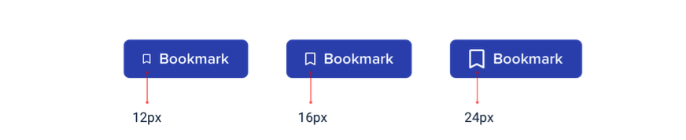

## 페이지 레이아웃이 말고 속성으로 시작

새로운 애플리케이션 아이디어를 디자인하기 시작할 때 가장 먼저 무엇을 디자인합니까? 내비게이션 바라면 실수하고 있는 것입니다.

새로운 디자인을 작업하는 동안 자신을 발견하는 가장 쉬운 방법은 '앱 디자인을 시도'하는 것입니다. 대부분의 사람들은 "앱 디자인"을 생각할 때 완성된 뷰를 직접적으로 생각합니다.

상단 내비게이션 바 또는 사이드바여야 합니까?

탐색 항목이 왼쪽 또는 오른쪽에 있어야 합니까?

페이지 콘텐츠는 컨테이너에 있어야 합니까 아니면 전체 너비에 있어야 합니까?

로고는 어디에 있어야 합니까?

사실 "앱"은 실제로 기능 모음입니다. 몇 가지 기능을 설계하기 전에는 탐색 작동 방식을 결정하는 데 필요한 정보조차 없으면 실망스러울 수 있습니다!
한 번에 전체 페이지를 디자인하는 대신 실제 기능을 점진적으로 시작하십시오.

예를 들어 항공편 예약 서비스를 만든다고 가정해 보겠습니다. "항공편 검색"과 같은 기능으로 시작할 수 있습니다.

인터페이스에 필요한 것:

- 출발 도시 필드
- 대상 도시에 대한 필드
- 출발일 입력란
- 귀국일 입력란
- 검색 버튼 하나
이거로 시작해 보세요 

좋아요, 다른 것들은 필요하지 않을 수도 있습니다. 이것은 Google에서 작동했습니다.

## 자세한 내용은 나중이요

새로운 기능을 디자인하는 초기 단계에서 서체, 그림자, 아이콘 등 다음과 같은 낮은 수준의 결정을 내리지 않는 것이 중요합니다.

이 모든 것들이 결국에는 중요하겠지만 지금 당장은 중요하지 않습니다.

스캐너나 좋아하는 디자인 도구와 같은 충실도가 높은 환경에서 작업할 때 세부 사항을 무시하기 어렵다면 Basecamp의 Jason Fried가 즐겨 사용하는 트릭 중 하나는 두꺼운 샤피를 사용하여 종이에 디자인하는 것입니다.

Sharpie로 작은 세부 사항에 매달릴 수 없으므로 다른 디자인 아이디어를 빠르게 탐색할 수 있는 좋은 방법이 될 수 있습니다.

### 색상 숨기기

다른 아이디어를 개발하기로 결정했다면 바로 색상을 추가하고 싶은 충동을 억제하십시오.

그레이스케일 디자인에서는 모든 대비, 간격 및 크기 설정을 조정해야 합니까

약간 어려울 수 있지만 나중에 색상을 추가하면 강력한 계층 구조로 더 명확한 인터페이스를 얻을 수 있습니다.

### 과잉 투자하지 마십시오

낮은 품질의 디자인을 하는 것의 요점은 가능한 빨리 실제 아이디어를 구축하기 시작할 수 있도록 빠르게 행동할 수 있다는 것입니다.

스케치와 와이어프레임은 일회용입니다. 사용자는 정적 인스턴스로 아무 것도 할 수 없습니다. 그것들을 사용하여 아이디어를 탐색하고 결정할 때 남겨 두십시오.

## 너무 많이 디자인하지 마세요

구현하기 전에 앱의 모든 기능을 디자인할 필요는 없습니다. 사실, 안 하는 게 낫습니다.

제품의 각 기능이 상호 작용하는 방식과 각 가장자리의 모양을 이해하는 것은 특히 추상적인 측면에서 정말 어렵습니다.

사용자에게 2000개의 연락처가 있는 경우 이 화면은 어떻게 보여야 합니까?

이 양식에서 오류 메시지는 어디에 있어야 합니까?

동시에 두 개의 이벤트가 예정되어 있을 때 이 캘린더는 어떻게 보여야 합니까?

디자인 도구와 상상력만으로 그런 것들을 해결하려 한다면 스스로 실망하게 될 것입니다.

### 루프 작업우로 하세요

모든 것을 미리 디자인하지 않고 짧은 루프로 작업합니다. 생성하려는 다음 기능의 간단한 버전을 설계하여 시작하십시오.

기본 디자인에 만족하면 현실화하십시오.

그 과정에서 예상치 못한 문제에 부딪히게 될 수도 있지만 그게 핵심입니다! 모든 마지막 상황을 미리 상상하는 것보다 실제로 사용할 수 있는 인터페이스에서 디자인 문제를 해결하는 것이 훨씬 쉽습니다.

더 이상 해결할 문제가 없을 때까지 작업 설계를 계속한 다음 설계 모드로 돌아가 다음 기능 작업을 시작하십시오.

### 비관적이세요

설계에 기능을 제공할 준비가 되지 않은 기능을 추가하지 마십시오.

예를 들어 프로젝트 관리 도구의 주석 시스템에서 작업 중이라고 가정해 보겠습니다. 언젠가 사용자가 자신의 댓글에 파일을 첨부할 수 있기를 원한다는 것을 알고 있으므로 첨부 파일 섹션을 디자인에 추가합니다.

응용 프로그램을 더 깊이 파고들면 댓글 지원 첨부 파일이 예상보다 훨씬 더 많은 일을 나오게 한다는 것을 알게 됩니다. 지금 당장 마칠 시간이 없기 때문에 다른 우선 순위를 처리하는 동안 전체 댓글 시스템을 백그라운드로 던져버렸습니다.

첨부 파일이 없는 댓글 시스템은 댓글 시스템이 없는 것보다 여전히 낫지만 처음부터 포함할 계획했으니까 게시할 수 있는 항목이 없습니다.

새 기능을 설계할 때 **만들기 어려울 것으로 예상**하세요. 릴리스할 사용 가능한 가장 작은 버전을 설계하면 이러한 위험이 크게 줄어듭니다.

기능의 일부가 "더 나은 것"이라면 **나중에 설계하십시오**. 간단한 버전을 먼저 빌드하면 항상 참조할 항목이 있읍니다.

## 개성을 선택하세요

모든 디자인에는 일종의 개성이 있습니다. 은행 사이트가 안전하고 전문적인 커뮤니케이션을 시도하는 동안 트렌디한 새 벤처는 재미있고 유쾌한 디자인을 가질 수 있습니다.

디자인에 특정 개성을 부여하는 것은 추상적으로 들릴 수 있지만 많은 것은 몇 가지 구체적인 요소에 의해 결정됩니다.

### 글꼴 선택

타이포그래피는 디자인의 느낌을 결정하는 데 큰 역할을 합니다.

우아하거나 고전적인 모양을 원한다면 디자인에 serif 글꼴을 추가할 수 있습니다.

Eğlenceli bir görünüm için yuvarlak bir sans serif kullanabilirsiniz:

더 단순한 모양을 찾고 있거나 개성을 제공하기 위해 다른 요소에 의존하고 싶다면 중립적인 산세리프가 좋은 선택이 될 것입니다.

### 색상

색상 심리학에는 많은 과학이 있지만 실제로는 다양한 색상이 어떻게 느끼는지에 주의를 기울여야 합니다.
파란색은 안전하고 친숙합니다. 아무도 파란색에 대해 불평하지 않습니다.

우리는 금이 "비싸고" "정교하다"고 말할 수 있습니다.

핑크 조금 더 재미있고 심각하지 않습니다.

심리학만을 사용하여 색상을 선택하는 것은 그다지 실용적이지 않지만 대부분의 색상은 자신에게 적합한 색상입니다. 색상이 올바른 이유를 이해하는 것이 도움이 될 수 있습니다.

### Border radius

작게 들리겠지만 디자인의 모서리를 날카롭게 다듬는 정도는 전체적인 생각에 큰 영향을 미칠 수 있습니다.

작은 경계 반경은 상당히 중립적이며 그 자체로는 성격을 많이 드러내지 않습니다.

넓은 테두리 반경이 더 재미있게 느껴지기 시작합니다.

... 경계 반경이 없으면 훨씬 더 심각하거나 형식적으로 느껴집니다

무엇을 선택하든 일관성을 유지하는 것이 중요합니다. 동일한 인터페이스에서 날카로운 모서리와 둥근 모서리를 혼합하면 거의 항상 둘 중 하나에 따라 더 나빠 보입니다.

### 언어

시각적 디자인 기술 자체는 아니지만 인터페이스에서 사용하는 단어는 전반적인 개성에 큰 영향을 미칩니다.

덜 개인적인 스타일을 사용하면 더 형식적이거나 전문적으로 느껴질 수 있습니다.

...더 친근하고 편안한 언어를 사용하면 사이트가 더 친근하게 느껴질 것입니다.

단어는 UI 전체에 있으며 올바른 단어를 선택하는 것은 올바른 색상이나 글꼴을 선택하는 것만큼(심지오 더 많이) 중요합니다.

### 당신이 정말로 원하는 것을 결정하십시오

대부분의 경우 당신은 당신이 목표로 삼고 있는 성격에 대해 직감할 것입니다. 그러나 그렇지 않은 경우 결정을 단순화하는 가장 좋은 방법은 대상 그룹 사람들이 사용하는 다른 사이트를 탐색하는 것입니다.
목적이 대부분 "심각한 작업"인 경우 이러한 방식으로 디자인에 방향을 지정할 수 있습니다. 그들이 약간의 유머에 빠져 있다면 그것도 좋은 일이 될 수 있습니다.

직접적인 다른 사람들의 디자인에 너무 영향을 받지 않도록 하십시오. 다른 것의 2류 버전처럼 보이고 싶지는 않습니다.

## 선택을 제한하세요 

수백만 가지의 색상과 수천 가지의 글꼴 중에서 선택할 수 있다는 것이 이론적으로는 좋게 들릴 수 있지만 실제로는 심각한 저주가 되는 경우가 많습니다.

또한 글꼴과 색상뿐만 아니라 거의 모든 작은 디자인 결정으로 인해 시간을 쉽게 낭비할 수 있습니다.

이 텍스트는 12px 또는 13px이어야 합니까?

이 상자 그림자는 10% 불투명도여야 합니까 아니면 15% 불투명도여야 합니까?

이 아바타의 높이는 24px 또는 25px이어야 합니까?

이 버튼에 중간 글꼴 굵게 또는 세미볼드를 사용해야 합니까?

이 제목의 여백 하단은 18px 또는 20px이어야 합니까?

제약 없이 설계할 때 의사 결정은 항상 하나 이상의 올바른 선택이 있기 때문에 고문입니다.

예를 들어, 이 버튼들은 모두 다른 배경색을 가지고 있지만, 그것들을 보는 것만으로는 차이를 구분하는 것이 거의 불가능합니다.

이것들 중 어느 것도 정말 나쁜 선택이 아니라면 어떻게 확신에 찬 결정을 내리겠습니까?

### 시스템을 미리 정의

결정을 내려야 할 때 무제한 풀에서 개별 값을 선택하는 대신 더 작은 옵션 세트로 시작하십시오.

새로운 파란색 음영을 선택해야 할 때 색상 팔레트를 보지 말고 미리 선택된 8-10 음영 세트에서 선택하십시오.

마찬가지로 완벽해 보일 때까지 글꼴 크기를 한 번에 한 픽셀씩 변경하지 마십시오. 제한적인 유형 배율을 미리 정의하고 이를 사용하여 향후 글꼴 크기 결정을 내립니다.

이와 같은 시스템을 구축할 때마다 새로운 UI를 설계할 때마다 한 번만 초기값을 선택하는 수고를 해야 합니다. 앞으로 해야 할 일이 조금 더 있지만 그만한 가치가 있습니다. 앞으로 많은 의사 결정을 내리지 않아도 될 것입니다.
### 심사과정에 따른 디자인

제한된 값 집합을 사용하여 디자인할 때 "올바른" 옵션이 훨씬 적기 때문에 의사 결정이 훨씬 쉽습니다.

예를 들어 아이콘의 크기를 선택하려고 한다고 가정해 보겠습니다. 중소형 크기 옵션이 12px, 16px, 24px 및 32px인 크기 조정 척도를 미리 정의했습니다.

가장 좋은 옵션을 선택하려면 어떤 것이 가장 잘 보일지, 아마도 16px 정도 추측하는 것부터 시작하십시오. 그런 다음 비교를 위해 양쪽(12px 및 24px)의 값을 시도합니다.

이러한 옵션 중 두 가지가 분명히 나쁜 선택처럼 보일 가능성이 있습니다. 측면에 있는 옵션이면 완료된 것입니다! 중간 옵션이 유일하게 좋은 선택입니다.

외부 옵션 중 하나가 가장 좋아 보인다면 중간 값과 함께 해당 옵션을 또 다른 비교로 사용하고 더 나은 선택이 없는지 확인합니다.

이 접근 방식은 시스템을 정의하는 모든 항목에 적용됩니다. 옵션의 범위가 제한되어 있고 모든 옵션이 확연히 다르게 보일 때 가장 좋은 것을 선택하는 것은 어린이 놀이가 될 것입니다.

### 모든 것을 시스템으로 하세요.

시스템이 많을수록 작업 속도가 빨라지고 자신의 결정에 대한 추측이 줄어듭니다.

다음과 같은 시스템을 정의하고 싶을 것입니다.

- 글꼴 크기
- 글꼴 두께
- 라인 높이
- 색깔
- 마진
- 패딩
- 너비
- 키
- 상자 그림자
- 테두리 반경
- 테두리 폭
- 불투명도
...그리고 저수준 디자인 작업을 하고 있는 것처럼 느껴지는 다른 모든 것 위해도.

이 모든 것을 미리 정의할 필요는 없으며 시스템 지향적인 사고 방식으로 디자인에 접근해야 합니다. 새로운 결정을 내릴 때 새로운 시스템을 도입할 기회를 찾고 같은 작은 결정을 두 번 하지 않도록 노력하십시오.
시스템 설계는 이 문서 전체에서 되풀이되는 주제가 될 것이며 이러한 시스템 구축에 대해서는 이후 장에서 더 자세히 설명할 것입니다.