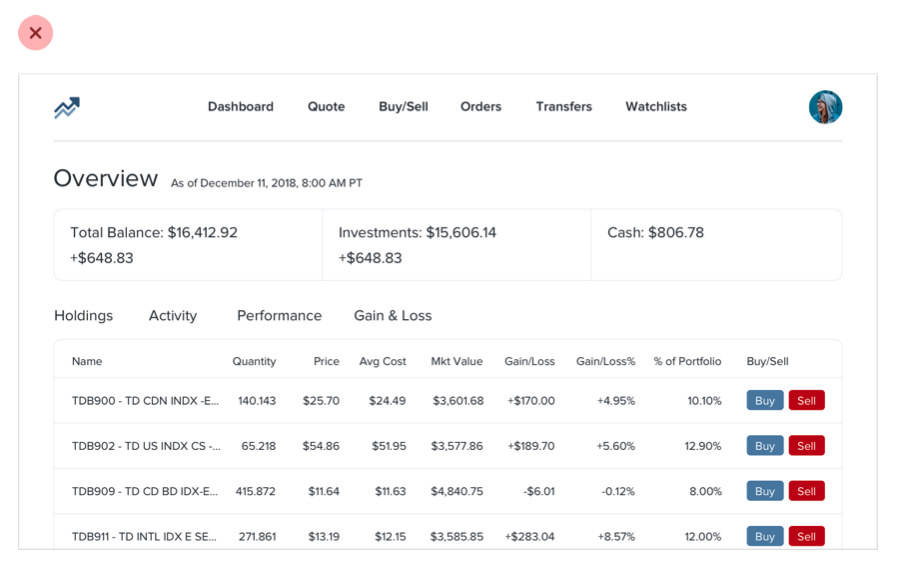
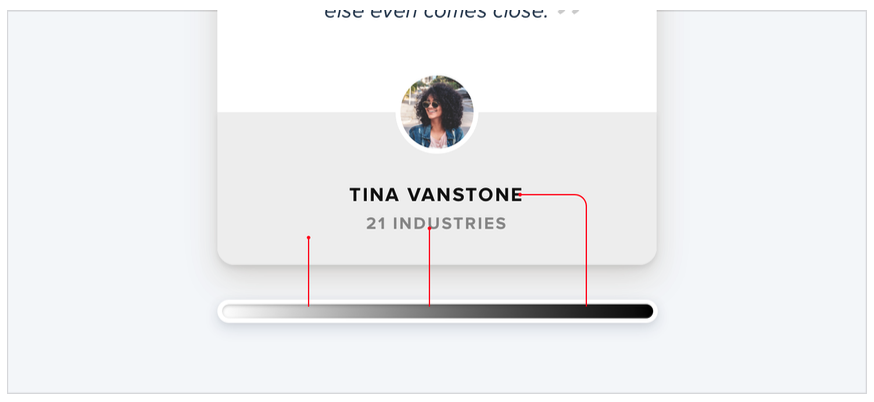
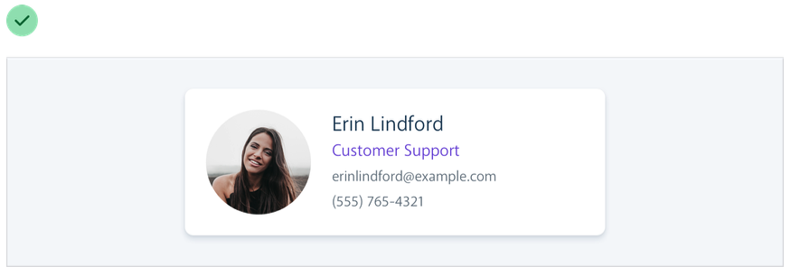
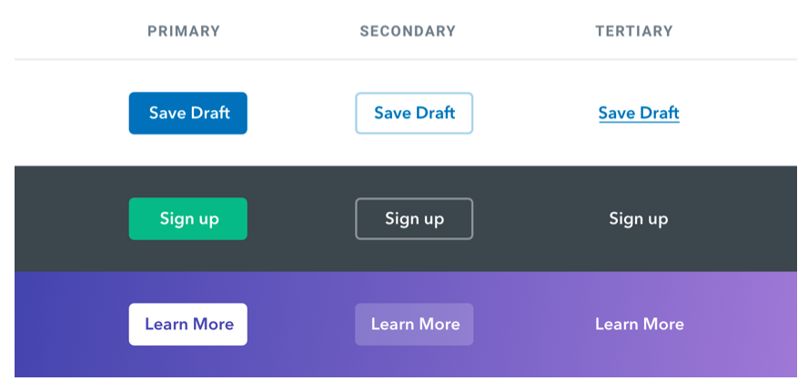

Hiyerarşi, bir sayfadaki öğelerin nasıl düzenlendiği ve birbirlerine nasıl bağlantılı olduğu ile ilgili bir kavramdır. Güçlü bir hiyerarşi, görüntüleyiciye yol gösterir ve bir sayfanın ya da bir uygulamanın anlaşılır ve kolayca kullanılabilir bir görsel yapısını oluşturur. Bu, farklı tekniklerin kullanımıyla gerçekleştirilir, örneğin boyut ve yazı tipi farklılıkları, renk ve kontrast, boşluk ve yerleşim gibi. Hiyerarşiyi iyi tanımlayan tasarımcılar, kullanıcıları en önemli öğelere odaklamaya ve gereken bilgiyi hızlı bir şekilde bulmaya yardımcı olabilirler.

## Tüm öğeler eşit değildir

Görsel tasarım sadece güzel görünen renkler ve yazı tipleri seçmekten ibaret değildir. Ayrıca, kullanıcıların bir web sitesini ya da uygulamayı anlamalarına ve gezinti yapmalarına yardımcı olan net ve etkili bir düzen ve hiyerarşi oluşturmak da gerekir. Diğer bir deyişle, iyi bir görsel tasarım sadece şeylerin güzel görünmesi değil, aynı zamanda anlaşılır ve kullanıcı dostu bir deneyim oluşturmaktır. Bu, doğuştan sanatsal bir yeteneğe sahip olmasanız bile, net ve etkili bir görsel yapı oluşturmaya odaklanarak görsel olarak dikkat çekici tasarımlar oluşturabileceğiniz anlamına gelir.

Tasarımda görsel hiyerarşi, arayüzdeki elemanların birbiriyle ilişkilerine göre göründükleri önem derecesini ifade eder ve bir şeyin "iyi göründüğü" hissini yaratmak için kullandığınız en etkili araçtır.

Arayüzde her şeyin dikkat çekmeye çalıştığında, içeriklerin birbirine karıştığı, neyin önemli olduğunun belirsiz olduğu bir duvar gibi gürültülü ve kaoslu bir his oluşur.

Görsel hiyerarşi üzerinde odaklanarak, tasarımcılar renk şeması, yazı tipi seçimi veya düzeni değiştirmeden bir arayüzü daha pürüzsüz ve düzenli hale getirebilirler. İkincil ve üçüncül bilgilerin vurgusunu azaltarak ve en önemli öğeleri vurgulamaya çalışarak, tasarımcılar anlaşılır ve kolayca kullanılabilir bir görsel yapı oluşturabilirler. Bu, görüntüleyicinin gözünü yönlendirir ve sayfadaki içeriği anlamalarına yardımcı olur. Bu, arayüzü daha görsel olarak dikkat çekici ve kullanıcı dostu hale getirebilir, ancak genel tarz değişmemiş olabilir.

Bir tasarımda güçlü bir görsel hiyerarşi oluşturmak için tasarımcılar çeşitli stratejiler ve teknikler kullanabilirler. Bu stratejilerin bazıları, vurgu oluşturmak için boyut ve yazı tipi farklılıklarını, önemli öğeleri vurgulamak için renk ve kontrastı, görsel ayrım ve hiyerarşi oluşturmak için boşluğu ve kullanıcının gözünü yönlendirmek için yerleşimi kullanmayı içerebilir. Bu stratejileri düşünceli ve planlı bir şekilde uygulayarak, tasarımcılar anlaşılır ve kolayca kullanılabilir bir görsel yapı oluşturabilirler. Bu, kullanıcıların bir arayüzü anlamalarına ve gezinti yapmalarına yardımcı olur. İlerleyen bölümlerde, bu stratejileri daha ayrıntılı olarak ele alacağız ve uygulama örnekleri vereceğiz.

## Boyut her şey değildir

Hiyerarşiyi kontrol etmek için yazı tipi boyutuna aşırı bağımlılık bir hata olabilir - çünkü genelde ana içerik çok büyük, ikincil içerik de çok küçük olur.

Yazı tipi boyutunu tek başına kullanarak görsel hiyerarşiyi oluşturmak yerine, tasarımcılar yazı tipi ağırlığı veya renk gibi teknikleri de kullanarak aynı etkiyi elde edebilirler. Örneğin, birinci başlığı ikinci başlıktan daha büyük yapmak yerine, birinci başlık için daha kalın bir yazı tipi ağırlığı kullanarak daha belirgin hale getirebilirsiniz. Benzer şekilde, birinci başlığı daha fark edilebilir hale getirmek için farklı bir renk kullanabilirsiniz.

Örneğin, bir ana öğeyi daha kalın yaparak daha makul bir yazı tipi boyutu kullanmanıza izin verir ve genelde önemini iletmek için daha iyi bir iş yapar.

Destekleyici metin için küçük bir yazı tipi boyutu kullanmak yerine, tasarımcılar metnin ikincil önemde olduğunu göstermek için daha yumuşak bir renk kullanabilirler. Bu, kullanıcıya metnin ana içerik kadar önemli olmadığını anlamasına yardımcı olur, ancak hala okunabilirdir.

İki veya üç renkte kalmaya çalışın:

- Ana içerik için koyu bir renk (bir makale başlığı gibi).
- İkincil içerik için bir gri (bir makale yayınlandığı tarih gibi).
- Üçüncül içerik için daha hafif bir gri (belki bir footer'daki telif hakkı notu).

Benzer şekilde, UI çalışmaları için genellikle yeterli olan iki font ağırlığı vardır:

- Bir normal font ağırlığı (yazı tipine bağlı olarak 400 veya 500) çoğu metin için.
- Vurgulamak istediğiniz metin için daha ağır bir font ağırlığı (600 veya 700).

UI tasarımı için 400 altındaki font ağırlıklarından uzak durun - büyük başlıklar için işe yarayabilir ancak daha küçük boyutlarda okunması zor olabilir. Bazı metnileri vurgulamak için daha hafif bir ağırlık kullanmayı düşünüyorsanız, bunun yerine daha hafif bir renk veya daha küçük bir yazı tipi boyutu kullanın.

## Renkli arka planlarda gri metin kullanmayın.

Renkli arka planlarda metni hafif bir griye boyamak, beyaz arka planlarda vurgulamayı azaltmak için harika bir yoldur, ancak renkli arka planlarda iyi görünmez. Bunun yerine, arka plan renginin birkaç ton daha açık veya koyu olduğu bir renk kullanmayı deneyin, veya vurgu ve hiyerarşi oluşturmak için farklı bir yazı tipi boyutu veya ağırlığı kullanın.

Bu, gerçekten beyaz üzerinde gördüğümüz etkinin kontrastı azalttığı anlamına gelir.

Gerçekten hiyerarşiyi oluşturan şey, metni arka plan rengine yaklaştırmaktır, onu açık gri yapmak değil.

 Belki de bu hedefe ulaşmanın en kolay yolunun beyaz metin kullanarak matlığı azaltmak olduğunu düşünebilirsiniz:

Bu, kontrastı azaltır ancak genelde metnin soluk ve bazen engellenmiş göründüğü sonuçlar doğurur.

Daha da kötüsü, bu yaklaşımı bir resim veya desen üzerine kullanmak, metnin arka planının göründüğü anlamına gelir:

Daha iyi bir yaklaşım, arka plan rengine dayalı olarak elle bir renk seçmektir.

Aynı tonu seçin ve doğruluk için doygunluk ve aydınlık değerlerini ayarlayın:

Bu şekilde elle bir renk seçmek, metnin soluk görünmemesi için kontrastı kolayca azaltmayı sağlar.

## Azaltarak vurgulama

Bazen bir arayüzün ana öğesi yeterince belirgin olmadığı durumlarla karşılaşabilirsiniz, ancak ona vurgu yapmak için ekleyebileceğiniz bir şey yoktur.

Örneğin, farklı bir renk vererek bu etkin gezinme öğesini öne çıkarmaya çalışmamıza rağmen, hala pasif öğelerle karşılaştırıldığında gerçekten öne çıkmıyor:

Bu gibi durumlarla karşılaştığınızda, dikkat çekmek istediğiniz öğeyi daha da vurgulamaya çalışmak yerine, onunla rekabet eden unsurların önemini azaltmanın nasıl mümkün olduğunu düşünün.

Bu örnekte, pasif öğelere daha yumuşak bir renk vererek, arka planda daha az öne çıkmalarını sağlayabilirsiniz:

Bu düşünce tarzını arayüzün daha büyük parçalarına da uygulayabilirsiniz. Örneğin, bir kenar çubuğu ana içerik alanınızla rekabet ediyorsa, arka plan rengi vermeyin - içeriği doğrudan sayfa arka planında bırakın:

## Etiketler son çare

Erişilebilirliği zora sokmayın — bu formlar hakkında değil.

Kullanıcıya veri sunarken (özellikle veritabanından gelen verilerde), veriyi basit bir etiket değer formatı kullanarak görüntüleme tuzağına düşmek kolaydır.

Bu yaklaşımın sorunu, veriyi her bir veri parçasına eşit vurgu yaparak hiyerarşik bir yapıda sunmayı zorlaştırmasıdır.

### Her zaman label kullanmayabilirsiniz.

Birçok durumda, verinin formatına bakarak ne olduğunu söyleyebilirsiniz.

Örneğin, janedoe@example.com bir e-posta adresidir, (555) 765-4321 bir telefon numarasıdır ve $19.99 bir fiyattır.

Format yeterli olmadığında, bağlam genellikle yeterli olur. Bir çalışan dizininde birinin adının altında "Müşteri Desteği" ifadesini görüyorsanız, kişinin hangi departmanda çalıştığını bağlantıyı kurmak için bir etikete ihtiyacınız yoktur.

Veriyi etiketsiz olarak sunabildiğinizde, önemli veya tanımlayıcı bilgileri vurgulamak çok daha kolay olur, bu da arayüzü daha kolay kullanılır hale getirirken aynı zamanda daha "tasarlanmış" hissettirir.

### Etiketleri ve değerleri birleştirin

Bir veri parçası bir etiket olmadan tamamen net olmasa bile, değere açıklayıcı metin ekleyerek etiket eklemeyi genellikle önleyebilirsiniz.

Örneğin, bir e-ticaret arayüzünde stokları göstermeniz gerekiyorsa, "Stokta: 12" yerine "Stokta 12 adet kaldı" gibi bir şey deneyebilirsiniz.

Eğer bir emlak uygulaması oluşturuyorsanız, "Yatak Odaları: 3" gibi bir şey basitçe "3 yatak odası" olabilir.

Etiketleri ve değerleri tek bir birimde birleştirebildiğinizde, her veri parçasına anlamlı bir stil vermek çok daha kolay olur ve aynı zamanda açıklıkta ödün vermezsiniz.

### Etiketler ikincil öneme sahiptir

Bazen gerçekten bir etikete ihtiyacınız olabilir; örneğin bir gösterge tablosunda olduğu gibi, benzer verilerin birden fazlasını görüntülediğinizde ve kolayca taranmaları gerektiğinde.

Bu durumlarda, etiketi ekleyin ancak destekleyici içerik olarak işlem yapın. Veri önemli olan şeydir, etiket sadece açıklık için oradadır.

Etiketin dikkat çekiciliğini azaltmak için, yazı tipi boyutunu küçültün, kontrastı azaltın, daha hafif bir yazı tipi kullanın veya üçünün kombinasyonunu kullanın.

### Etiketi ne zaman vurgulamanız gerekir

Eğer kullanıcının etiketi arayacağı bilinen bir arayüz tasarlıyorsanız, veri yerine etiketi vurgulamak daha mantıklı olabilir.

Bu, ürünlerin teknik özellikleri gibi bilgi yoğun sayfalarda sıklıkla görülen bir durumdur.

Kullanıcı, bir akıllı telefonun ölçülerini öğrenmeye çalışırken, muhtemelen "derinlik" gibi kelimeleri sayfada tarayacaktır, "7.6mm" gibi verileri değil.

Bu durumlarda veriyi çok fazla önemsizleştirmeyin; hala önemli bilgi. Etiket için daha koyu renk ve değer için biraz daha açık renk kullanmak genellikle yeterlidir.

## Görsel hiyerarşiyi belge hiyerarşisinden ayırın

Web için tasarım yaparken anlamsal işaretleme kullanmak önemlidir. Bu, bir arayüzün bir bölümüne başlık eklemeyi seçerseniz h1, h2 veya h3 gibi başlık etiketlerini kullanmanız gerekeceği anlamına gelir.

Web tarayıcıları varsayılan olarak başlık öğelerine giderek daha küçük yazı tipi boyutları atarlar, bu nedenle bir h1 oldukça büyükken, bir h6 oldukça küçüktür. Bu, makale veya belge gibi belge tarzı içerikler için faydalı olabilir, ancak uygulama kullanıcı arayüzlerinde bazı yanlış kararlar alınmasına neden olabilir.

Bir sayfaya Manage Account gibi bir başlık eklemek için h1 etiketini kullanmak anlamsal olarak mükemmel bir anlam taşır, ancak h1 öğelerinin büyük olması gerektiğine inanmamız nedeniyle, bu başlıkları gerçekten olması gerektiğinden daha büyük yapmak kolaydır.

Çok zaman, bölüm başlıkları, başlıklardan ziyade etiketler gibi davranır - destekleyici içeriklerdir, tüm dikkati çekmemelidirler.

Genellikle, o bölümdeki içerik odak noktası olmalıdır, bu da çoğu zaman başlıkların gerçekten küçük olması gerektiği anlamına gelir:

Aşırıya kaçarak, erişilebilirlik nedenleriyle bölüm başlıklarını işaretlemenize rağmen içeriği kendisi konuştuğu için bunları görsel olarak tamamen gizleyebilirsiniz.

Kullanacağınız öğelerin stilini seçmeniz için elemanın sizi etkilemesine izin vermeyin - en iyi görsel hiyerarşiyi oluşturmak için anlamsal amaçlar için öğeler seçin ve istediğiniz gibi stilize edin.

## Ağırlık ve kontrastı dengeleyin

Kalın metnin normal metne göre vurgulu hissettirmesinin nedeni, kalın metnin daha fazla yüzey alanını kaplamasıdır. Aynı alanda, metin için arka plana kıyasla daha fazla piksel kullanılır.

Peki neden bu ilginç? Aslında yüzey alanı ve hiyerarşi arasındaki ilişki, bir UI'deki diğer öğeler üzerinde de etkileri olduğunu gösteriyor.

### Ağırlık için kontrast kullanmak

Bu ilişkiyi anlamanın önemli olduğu yerlerden biri, ikonlarla çalışırken önem kazanır.

Kalın yazı karakterleri gibi, ikonlar (özellikle dolu olanlar) genellikle oldukça "ağır" ve yüzey alanının büyük bir kısmını kaplarlar. Sonuç olarak, bir metin yanına bir ikon koyduğunuzda, ikon vurgulanmış gibi hissettirir.

Metin gibi, bir ikonun "ağırlığını" değiştirmenin bir yolu yoktur, bu nedenle denge oluşturmak için başka bir şekilde vurgulamayı azaltmak gerekiyor.

Bunun basit ve etkili bir yolu, ikona daha yumuşak bir renk vererek kontrastı azaltmaktır.

Bu, farklı ağırlıkları olan öğeleri dengelemeye ihtiyaç duyduğunuz herhangi bir yerde çalışır. Kontrastı azaltmak, daha ağır olan öğelerin ağırlığını değiştirmeden, daha hafif hissettirmek için bir dengeleme işlevi görür.

### Kontrastı dengelemek için ağırlık kullanma

Kontrastı azaltmanın ağır elementleri göreceli olarak önemsiz hale getirdiği gibi, düşük kontrastlı elementlere bir miktar vurgu eklemenin harika bir yolu ağırlığını artırmaktır.

Bu, ince 1 piksel kenarlıklar gibi şeyler çok yumuşak renkler kullanarak çok hafif kalırsa, ancak rengi koyulaştırmak tasarımı sert ve gürültülü hale getiriyorsa faydalıdır.

Genişliği biraz artırarak çizginin ağırlığını artırmak, daha yumuşak bir görünüm kaybetmeden vurgulamaya yardımcı olur:

## Semantikler ikincildir

Bir sayfada kullanıcının yapabileceği birden fazla eylem varsa, bu eylemleri sadece anlamsal açıdan tasarlamak kolaydır.

Anlamsal açıdan buton tasarımının önemli bir parçasıdır, ancak bu hiyerarşiyi unutabileceğiniz anlamına gelmez.

Her sayfadaki her eylem, önem piramidinde bir yerde bulunur. Çoğu sayfa yalnızca bir tane gerçek bir birincil eyleme, birkaç önemsiz ikincil eyleme ve birkaç nadiren kullanılan üçüncül eyleme sahiptir.

Bu eylemleri tasarlarken, hiyerarşideki yerlerini iletmek önemlidir.

- **Birincil eylemler açık olmalıdır.** Burada katı, yüksek kontrastlı arka plan renkleri harika çalışır.
- **İkincil eylemler açık olmalı, ancak önemli değil.** Çizim stilleri veya daha az kontrastlı arka plan renkleri harika seçeneklerdir.
- **Üçüncül eylemler keşfedilebilir ancak göze batmaz olmalıdır.** Bu eylemleri bağlantılar gibi stilize etmek genellikle en iyi yaklaşımdır.

Sayfadaki eylemleri hiyerarşi odaklı bir yaklaşımla tasarlarsanız, sonuç daha az yoğun bir kullanıcı arayüzü olur ve daha net bir şekilde iletilir:

### Yıkıcı eylemler

Yıkıcı veya yüksek ciddiyetli olmak, bir düğmenin büyük, kırmızı ve kalın olması anlamına gelmez.

Bir yıkıcı eylem sayfadaki birincil eylem değilse, ikincil veya üçüncül bir düğme işlemi vermek daha iyi olabilir.

Bunu, yıkıcı eylemin aslında birincil eylem olduğu onay adımı ile birleştirin ve büyük, kırmızı, kalın bir stile uygulayın.

