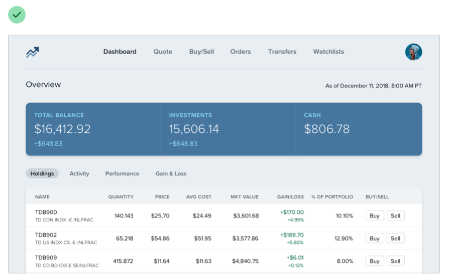
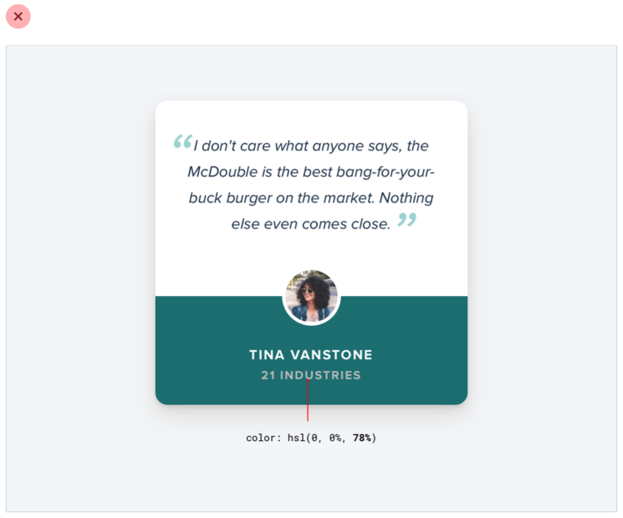
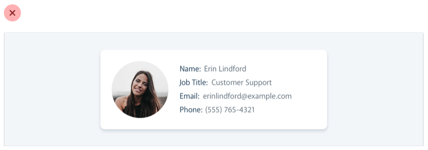
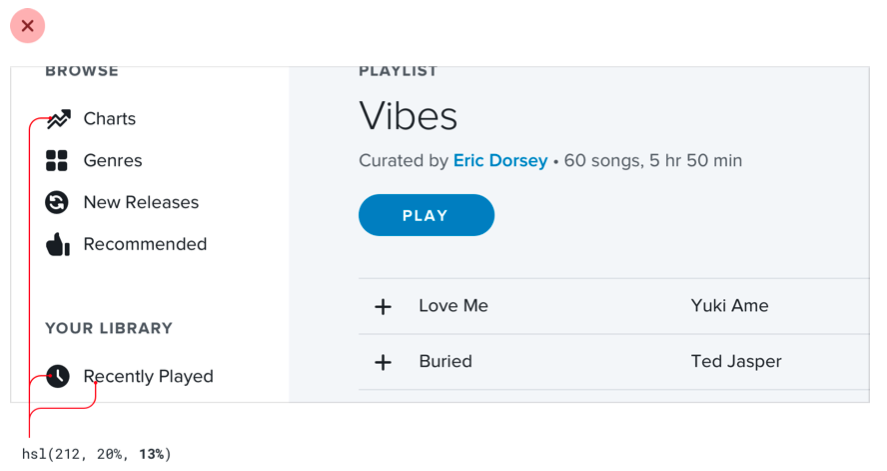
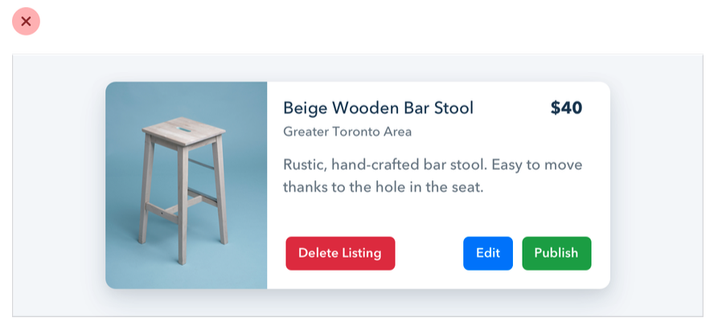

Hiyerarşi, bir sayfadaki öğelerin nasıl düzenlendiği ve birbirlerine nasıl bağlantılı olduğu ile ilgili bir kavramdır. Güçlü bir hiyerarşi, görüntüleyiciye yol gösterir ve bir sayfanın ya da bir uygulamanın anlaşılır ve kolayca kullanılabilir bir görsel yapısını oluşturur. Bu, farklı tekniklerin kullanımıyla gerçekleştirilir, örneğin boyut ve yazı tipi farklılıkları, renk ve kontrast, boşluk ve yerleşim gibi. Hiyerarşiyi iyi tanımlayan tasarımcılar, kullanıcıları en önemli öğelere odaklamaya ve gereken bilgiyi hızlı bir şekilde bulmaya yardımcı olabilirler.

## Tüm öğeler eşit değildir

Görsel tasarım sadece güzel görünen renkler ve yazı tipleri seçmekten ibaret değildir. Ayrıca, kullanıcıların bir web sitesini ya da uygulamayı anlamalarına ve gezinti yapmalarına yardımcı olan net ve etkili bir düzen ve hiyerarşi oluşturmak da gerekir. Diğer bir deyişle, iyi bir görsel tasarım sadece şeylerin güzel görünmesi değil, aynı zamanda anlaşılır ve kullanıcı dostu bir deneyim oluşturmaktır. Bu, doğuştan sanatsal bir yeteneğe sahip olmasanız bile, net ve etkili bir görsel yapı oluşturmaya odaklanarak görsel olarak dikkat çekici tasarımlar oluşturabileceğiniz anlamına gelir.

Tasarımda görsel hiyerarşi, arayüzdeki elemanların birbiriyle ilişkilerine göre göründükleri önem derecesini ifade eder ve bir şeyin "iyi göründüğü" hissini yaratmak için kullandığınız en etkili araçtır.

Arayüzde her şeyin dikkat çekmeye çalıştığında, içeriklerin birbirine karıştığı, neyin önemli olduğunun belirsiz olduğu bir duvar gibi gürültülü ve kaoslu bir his oluşur.

Görsel hiyerarşi üzerinde odaklanarak, tasarımcılar renk şeması, yazı tipi seçimi veya düzeni değiştirmeden bir arayüzü daha pürüzsüz ve düzenli hale getirebilirler. İkincil ve üçüncül bilgilerin vurgusunu azaltarak ve en önemli öğeleri vurgulamaya çalışarak, tasarımcılar anlaşılır ve kolayca kullanılabilir bir görsel yapı oluşturabilirler. Bu, görüntüleyicinin gözünü yönlendirir ve sayfadaki içeriği anlamalarına yardımcı olur. Bu, arayüzü daha görsel olarak dikkat çekici ve kullanıcı dostu hale getirebilir, ancak genel tarz değişmemiş olabilir.

Bir tasarımda güçlü bir görsel hiyerarşi oluşturmak için tasarımcılar çeşitli stratejiler ve teknikler kullanabilirler. Bu stratejilerin bazıları, vurgu oluşturmak için boyut ve yazı tipi farklılıklarını, önemli öğeleri vurgulamak için renk ve kontrastı, görsel ayrım ve hiyerarşi oluşturmak için boşluğu ve kullanıcının gözünü yönlendirmek için yerleşimi kullanmayı içerebilir. Bu stratejileri düşünceli ve planlı bir şekilde uygulayarak, tasarımcılar anlaşılır ve kolayca kullanılabilir bir görsel yapı oluşturabilirler. Bu, kullanıcıların bir arayüzü anlamalarına ve gezinti yapmalarına yardımcı olur. İlerleyen bölümlerde, bu stratejileri daha ayrıntılı olarak ele alacağız ve uygulama örnekleri vereceğiz.

## Boyut her şey değildir

Hiyerarşiyi kontrol etmek için yazı tipi boyutuna aşırı bağımlılık bir hata olabilir - çünkü genelde ana içerik çok büyük, ikincil içerik de çok küçük olur.

Yazı tipi boyutunu tek başına kullanarak görsel hiyerarşiyi oluşturmak yerine, tasarımcılar yazı tipi ağırlığı veya renk gibi teknikleri de kullanarak aynı etkiyi elde edebilirler. Örneğin, birinci başlığı ikinci başlıktan daha büyük yapmak yerine, birinci başlık için daha kalın bir yazı tipi ağırlığı kullanarak daha belirgin hale getirebilirsiniz. Benzer şekilde, birinci başlığı daha fark edilebilir hale getirmek için farklı bir renk kullanabilirsiniz.

Örneğin, bir ana öğeyi daha kalın yaparak daha makul bir yazı tipi boyutu kullanmanıza izin verir ve genelde önemini iletmek için daha iyi bir iş yapar.

Destekleyici metin için küçük bir yazı tipi boyutu kullanmak yerine, tasarımcılar metnin ikincil önemde olduğunu göstermek için daha yumuşak bir renk kullanabilirler. Bu, kullanıcıya metnin ana içerik kadar önemli olmadığını anlamasına yardımcı olur, ancak hala okunabilirdir.

İki veya üç renkte kalmaya çalışın:

- Ana içerik için koyu bir renk (bir makale başlığı gibi).
- İkincil içerik için bir gri (bir makale yayınlandığı tarih gibi).
- Üçüncül içerik için daha hafif bir gri (belki bir footer'daki telif hakkı notu).

Benzer şekilde, UI çalışmaları için genellikle yeterli olan iki font ağırlığı vardır:

- Bir normal font ağırlığı (yazı tipine bağlı olarak 400 veya 500) çoğu metin için.
- Vurgulamak istediğiniz metin için daha ağır bir font ağırlığı (600 veya 700).

UI tasarımı için 400 altındaki font ağırlıklarından uzak durun - büyük başlıklar için işe yarayabilir ancak daha küçük boyutlarda okunması zor olabilir. Bazı metnileri vurgulamak için daha hafif bir ağırlık kullanmayı düşünüyorsanız, bunun yerine daha hafif bir renk veya daha küçük bir yazı tipi boyutu kullanın.

## Renkli arka planlarda gri metin kullanmayın.

Renkli arka planlarda metni hafif bir griye boyamak, beyaz arka planlarda vurgulamayı azaltmak için harika bir yoldur, ancak renkli arka planlarda iyi görünmez. Bunun yerine, arka plan renginin birkaç ton daha açık veya koyu olduğu bir renk kullanmayı deneyin, veya vurgu ve hiyerarşi oluşturmak için farklı bir yazı tipi boyutu veya ağırlığı kullanın.

Bu, gerçekten beyaz üzerinde gördüğümüz etkinin kontrastı azalttığı anlamına gelir.

Gerçekten hiyerarşiyi oluşturan şey, metni arka plan rengine yaklaştırmaktır, onu açık gri yapmak değil.

 Belki de bu hedefe ulaşmanın en kolay yolunun beyaz metin kullanarak matlığı azaltmak olduğunu düşünebilirsiniz:

Bu, kontrastı azaltır ancak genelde metnin soluk ve bazen engellenmiş göründüğü sonuçlar doğurur.

Daha da kötüsü, bu yaklaşımı bir resim veya desen üzerine kullanmak, metnin arka planının göründüğü anlamına gelir:

Daha iyi bir yaklaşım, arka plan rengine dayalı olarak elle bir renk seçmektir.

Aynı tonu seçin ve doğruluk için doygunluk ve aydınlık değerlerini ayarlayın:

Bu şekilde elle bir renk seçmek, metnin soluk görünmemesi için kontrastı kolayca azaltmayı sağlar.

## Emphasize by de-emphasizing

Sometimes you’ll run into a situation where the main element of an interface isn’t standing out enough, but there’s nothing you can add to it to give it the emphasis it needs.

For example, despite trying to make this active nav item “pop” by giving it a different color, it still doesn’t really stand out compared to the inactive items:

When you run into situations like this, instead of trying to further emphasize the element you want to draw attention to, figure out how you can de- emphasize the elements that are competing with it.

In this example, you could do that by giving the inactive items a softer color so they sit more in the background:

You can apply this thinking to bigger pieces of an interface as well. For example, if a sidebar feels like it’s competing with your main content area, don’t give it a background color — let the content sit directly on the page background instead:

## Labels are a last resort

Put down the accessibility pitchfork — this isn’t about forms.

When presenting data to the user (especially data from the database), it’s
easy to fall into the trap of displaying it using a naive label: value format.

The problem with this approach is that it makes it difficult to present the data with any sort of hierarchy; every piece of data is given equal emphasis.

### You might not need a label at all

In a lot of situations, you can tell what a piece of data is just by looking at the format.

For example, janedoe@example.com is an email address, (555) 765-4321 is a phone number and $19.99 is a price.

When the format isn’t enough, the context often is. When you see the phrase “Customer Support” listed below someone’s name in an employee directory, you don’t need a label to make the connection that that is the department the person works in.

When you’re able to present data without labels, it’s much easier to emphasize important or identifying information, making the interface easier to use while at the same time making it feel more “designed”.

### Combine labels and values

Even when a piece of data isn’t completely clear without a label, you can often avoid adding a label by adding clarifying text to the value.

For example, if you need to display inventory in an e-commerce interface, instead of “In stock: 12”, try something like “12 left in stock”.

If you’re building a real estate app, something like “Bedrooms: 3” could simply become “3 bedrooms”.

When you’re able to combine labels and values into a single unit, it’s much easier to give each piece of data meaningful styling without sacrificing on clarity.

### Labels are secondary

Sometimes you really do need a label; for example when you’re displaying multiple pieces of similar data and they need to be easily scannable, like on a dashboard.

In these situations, add the label, but treat it as supporting content. The data itself is what matters, the label is just there for clarity.

De-emphasize the label by making it smaller, reducing the contrast, using a lighter font weight, or some combination of all three.

### When to emphasize a label

If you’re designing an interface where you know the user will be looking for the label, it might make sense to emphasize the label instead of the data.

This is often the case on information-dense pages, like the technical specifications of a product.

If a user is trying to find out the dimensions of a smartphone, they’re probably scanning the page for words like “depth”, not “7.6mm”.

Don’t de-emphasize the data too much in these scenarios; it’s still important information. Simply using a darker color for the label and a slightly lighter color for the value is often enough.

## Separate visual hierarchy from document hierarchy

It’s important to use semantic markup when building for the web, which means you’ll often be using heading tags like h1, h2, or h3 if you decide to add a title to part of an interface.

By default, web browsers assign progressively smaller font sizes to heading elements, so an h1 is pretty large, and an h6 is pretty small. This can be helpful for document-style content like articles or documentation, but it can encourage some bad decisions in application UIs.

Using an h1 tag to add a title like Manage Account to a page makes perfect sense semantically, but because we’re trained to believe that h1 elements should be big, it’s easy to fall into the trap of making those titles bigger than they really need to be.

A lot of the time, section titles act more like labels than headings — they are supportive content, they shouldn’t be stealing all the attention.

Usually the content in that section should be the focus, not the title. That means that a lot of the time, titles should actually be pretty small:

Taken to the extreme, you might even include section titles in your markup for accessibility reasons but completely hide them visually because the content speaks for itself.

Don’t let the element you’re using influence how you choose to style it — pick elements for semantic purposes and style them however you need to create the best visual hierarchy.

## Balance weight and contrast

The reason bold text feels emphasized compared to regular text is that bold text covers more surface area — in the same amount of space, more pixels are used for text than for the background.

So why is this interesting? Well it turns out that the relationship between surface area and hierarchy has implications on other elements in a UI as well.

### Using contrast to compensate for weight

One of the places understanding this relationship becomes important is when working with icons.

Just like bold text, icons (especially solid ones) are generally pretty “heavy” and cover a lot of surface area. As a result, when you put an icon next to some text, the icon tends to feel emphasized.

Unlike text, there’s no way to change the “weight” of an icon, so to create balance it needs to be de-emphasized in some other way.

A simple and effective way to do this is to lower the contrast of the icon by giving it a softer color.

This works anywhere you need to balance elements that have different weights. Reducing the contrast works like a counterbalance, making heavier elements feel lighter even though the weight hasn’t changed.

### Using weight to compensate for contrast

Just like how reducing contrast helps to de-emphasize heavy elements, increasing weight is a great way to add a bit of emphasis to low contrast elements.

This is useful when things like thin 1px borders are too subtle using a soft color, but darkening the color makes the design feel harsh and noisy.

Making the border a bit heavier by increasing the width helps to emphasize it without losing the softer look:

## Semantics are secondary

When there are multiple actions a user can take on a page, it’s easy to fall into the trap of designing those actions based purely on semantics.

Semantics are an important part of button design, but that doesn’t mean you can forget about hierarchy.

Every action on a page sits somewhere in a pyramid of importance. Most pages only have one true primary action, a couple of less important secondary actions, and a few seldom used tertiary actions.

When designing these actions, it’s important to communicate their place in the hierarchy.

- **Primary actions should be obvious.** Solid, high contrast background colors work great here.
- **Secondary actions should be clear but not prominent.** Outline styles or lower contrast background colors are great options.
- **Tertiary actions should be discoverable but unobtrusive.** Styling these actions like links is usually the best approach.

When you take a hierarchy-first approach to designing the actions on page, the result is a much less busy UI that communicates more clearly:

### Destructive actions

Being destructive or high severity doesn’t automatically mean a button should be big, red, and bold.

If a destructive action isn’t the primary action on the page, it might be better to give it a secondary or tertiary button treatment.

Combine this with a confirmation step where the destructive action actually is the primary action, and apply the big, red, bold styling there.

