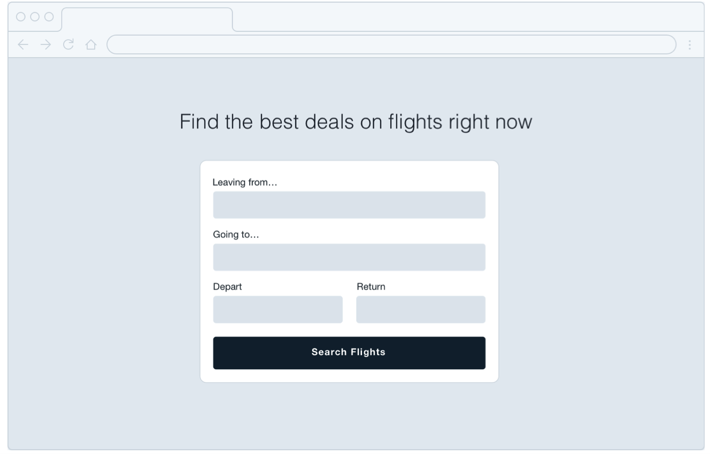
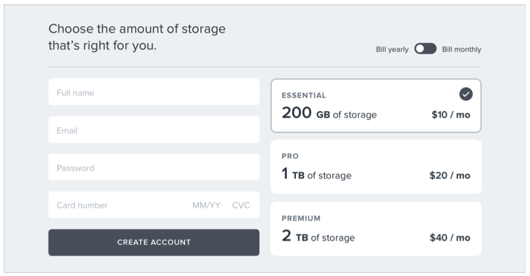
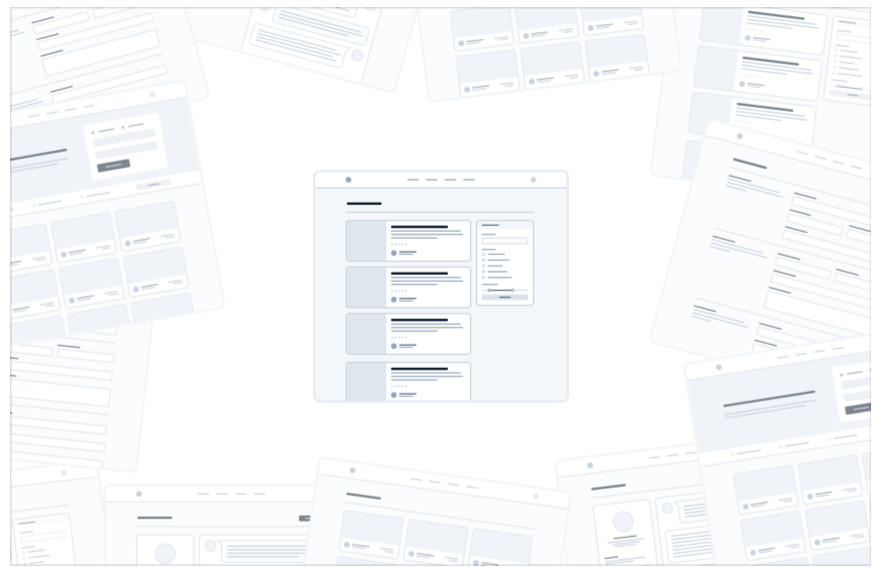
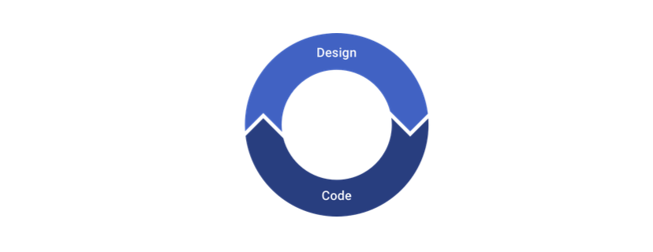
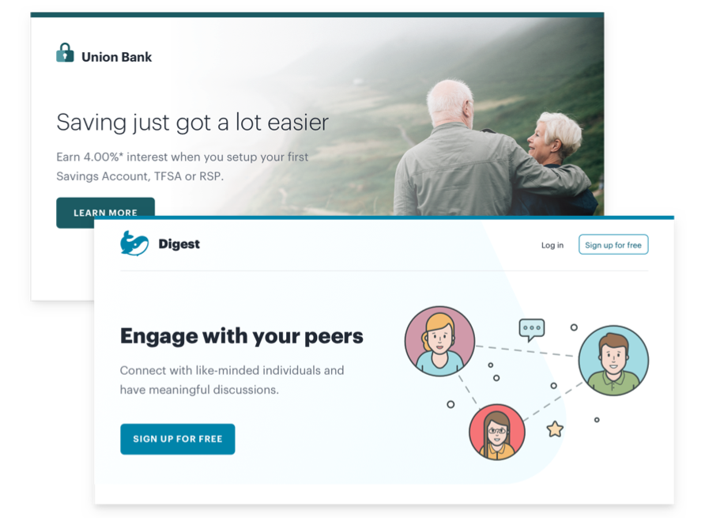
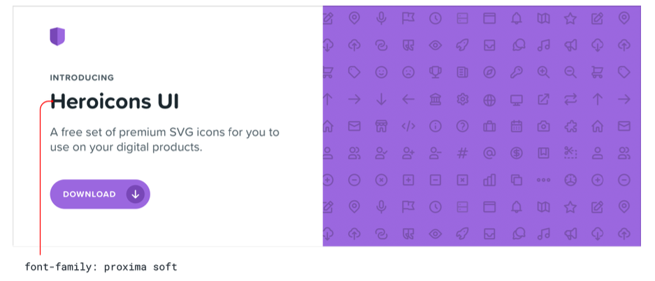
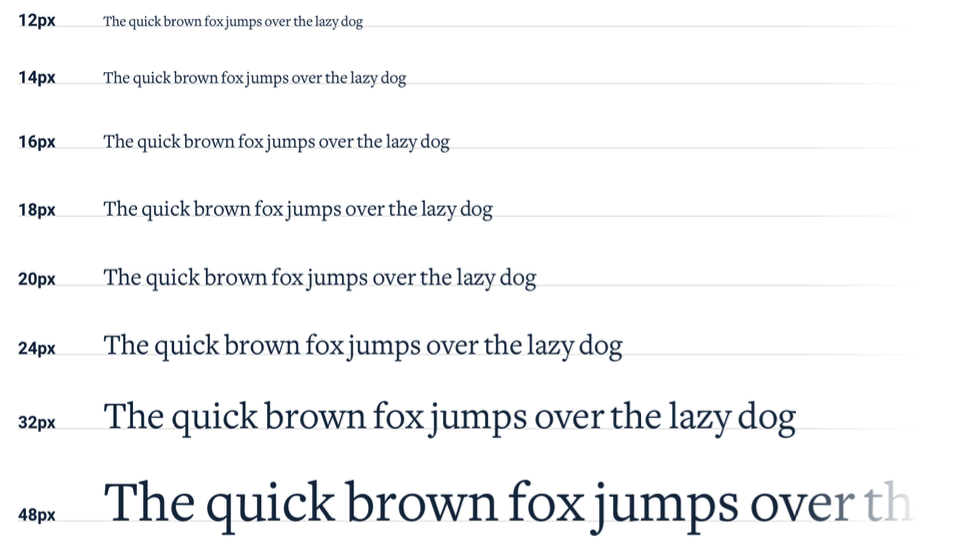

## Sayfa yerleşimi ile değil, bir özellik ile başlayın

Yeni bir uygulama fikri için tasarıma başladığınızda ilk olarak ne tasarlarsınız? Eğer bu bir navigation bar ise, bir hata yapıyorsunuz demektir.

Yeni bir tasarım üzerinde çalışırken kendinizi takılıp kalmış olarak bulmanın en kolay yolu 'uygulamayı tasarlamaya çalışmaktır'. Çoğu insan "uygulamayı tasarlamayı" düşündüğünde, direkt olarak tamamlanmış görünümü düşünür.

Bir top navigation bar mı olmalı yoksa bir sidebar mı olmalı?

Gezinme öğeleri solda mı yoksa sağda mı olmalı?

Sayfa içeriği bir container'da mı yoksa tam genişlikte mi olmalı?

Logo nerede durmalı?

Mesele şu ki, bir "uygulama" aslında bir özellikler koleksiyonudur. Birkaç özellik tasarlamadan önce, navigation'un nasıl çalışması gerektiğine karar vermek için ihtiyacınız olan bilgilere bile sahip değilsiniz. Bu sinir bozucu olabilir!

Tüm sayfayı bir anda tasarlamak yerine, parça parça gerçek işlevsellik ile başlayın.

Örneğin, bir uçuş rezervasyonu hizmeti oluşturduğunuzu varsayalım. “Uçuş arama” gibi bir özellikle başlayabilirsiniz.

Arayüzünüzün ihtiyacı olacak şeyler:

- Kalkış şehri için bir alan
- Hedef şehir için bir alan
- Kalkış tarihi için bir alan
- Dönüş tarihi için bir alan
- Arama yapmak için bir düğme

Bununla başlayın.

Çok iyi, diğer şeylere ihtiyacınız olmayabilir - Bu, Google'da işe yaradı.

## Detaylar sonra gelir

Yeni bir özellik tasarlamanın ilk aşamalarında, yazı biçimleri, gölgeler, simgeler vb. gibi şeyler hakkında düşük düzey kararlar vermeye takılıp kalmamanız önemlidir.

Bu şeylerin hepsi sonunda önemli olacak, ama şu anda önemi yok.

Tarayıcı veya en sevdiğiniz tasarım aracı gibi aslına uygunluğu yüksek bir ortamda çalışırken ayrıntıları göz ardı etmekte zorlanıyorsanız, Basecamp'tan Jason Fried'in kullanmayı sevdiği bir numara, kalın bir Sharpie kullanarak kağıt üzerinde tasarım yapın.

Bir Sharpie ile küçük ayrıntılara takılmak mümkün değildir, bu nedenle farklı bir tasarım fikrini hızla keşfetmenin harika bir yolu olabilir.

### Rengi gizleyin

Bir fikri daha geliştirmeye kesin gözüyle bakıyorsanız, rengi hemen ekleme isteğinize karşı koyun.

Gri tonlamalı tasarım ile bütün kontrast, boşluk ve boyut ayarlarını yapmak zorunda kalırsınız.

Bu sizi biraz zorlayabilir fakat daha sonra renkleri eklediğinizde güçlü bir hiyerarşiye sahip daha net bir arayüz elde edersiniz.

### Aşırı yatırım yapmayın

Düşük kaliteli tasarım yapmanın tüm amacı, hızlı hareket edebilmektir, böylece mümkün olan en kısa sürede gerçek düşünceyi inşa etmeye başlayabilirsiniz

Sketche'ler ve wireframe'ler tek kullanımlıktır; kullanıcılar statik örneklerle hiçbir şey yapamaz. Fikirlerinizi keşfetmek için bunları kullanın ve karar verdiğinizde onları geride bırakın.

## Çok fazla tasarlamayın

Uygulamaya geçmeden önce bir uygulamadaki her özelliği tasarlamanız gerekmez; Aslında, yapmasanız daha iyi.

Bir üründeki her özelliğin nasıl etkileşime girmesi gerektiğini ve her uç durumun nasıl görünmesi gerektiğini anlamak, özellikle soyut olarak gerçekten zordur.

Kullanıcının 2000 kişisi varsa bu ekran nasıl görünmelidir?

Hata mesajı bu formda nereye gitmeli?

Aynı anda programlanmış iki etkinlik olduğunda bu takvim nasıl görünmelidir?

Bu tür şeyleri yalnızca bir tasarım aracı ve hayal gücünüzü kullanarak çözmeye çalışırsanız kendinizi hayal kırıklığına uğratırsınız.

### Döngüler halinde çalışın

Her şeyi önceden tasarlamak yerine, kısa döngüler halinde çalışın. Oluşturmak istediğiniz bir sonraki özelliğin basit bir sürümünü tasarlayarak başlayın.

Temel tasarımdan memnun kaldığınızda, onu gerçeğe dönüştürün.

Muhtemelen yol boyunca bazı beklenmedik karmaşıklıklarla karşılaşacaksınız, ancak asıl mesele bu! Gerçekten kullanabileceğiniz bir arayüzde tasarım sorunlarını çözmek, her son durumu önceden hayal etmekten çok daha kolay.

Çözülecek başka sorun kalmayana kadar çalışan tasarım üzerinde devam edin, ardından tasarım moduna geri dönün ve bir sonraki özellik üzerinde çalışmaya başlayın.

### Karamsar olun

Tasarımlarınıza işlevselliği hazır olmayan özellikleri eklemeyin.

Örneğin, bir proje yönetim aracı için bir yorum sistemi üzerinde çalıştığınızı varsayalım. Bir gün kullanıcıların yorumlarına dosya ekleyebilmelerini istediğinizi biliyorsunuz, bu nedenle tasarımınıza ekler(attachments) bölümü ekliyorsunuz.

Uygulamanın derinliklerine indiğinizde, yorum destekleyici eklerin tahmin ettiğinizden çok daha fazla iş çıkaracağını anladınız. Şu anda bitirmek için zamanınız yok, bu nedenle siz diğer önceliklerle ilgilenirken tüm yorum sistemini arka plana attınız.

Mesele şu ki, ekleri olmayan bir yorum sistemi yine de hiç yorum sistemi olmamasından daha iyi olurdu, ancak onu ilk günden dahil etmeyi planladığınız için gönderebileceğiniz hiçbir şey yok.

Yeni bir özellik tasarlarken, **oluşturmanın zor olmasını bekleyin**. Çıkartacağınız en küçük kullanışlı sürümü tasarlamak, bu riski önemli ölçüde azaltır.

Bir özelliğin parçası "olsa iyi olur" ise, **onu daha sonra tasarlayın**. Önce basit sürümü oluşturun ve her zaman başvuracak bir şeyiniz olur.

## Bir kişilik seç

Her tasarımın bir çeşit kişiliği vardır. Bir bankacılık sitesi, güvenli ve profesyonel iletişim kurmaya çalışırken, modaya uygun yeni bir girişim, eğlenceli ve eğlenceli hissettiren bir tasarıma sahip olabilir.

Tasarıma belirli bir kişilik vermek kulağa soyut geliyor olabilir, ancak çoğu birkaç somut faktör tarafından belirlenmektedir.

### Yazı tipini seçin

Tipografi, bir tasarımın nasıl hissettirdiğini belirlemede büyük rol oynar.

Zarif veya klasik bir görünüm istiyorsanız, tasarımınıza bir serif yazı tipi eklemek isteyebilirsiniz:

Eğlenceli bir görünüm için yuvarlak bir sans serif kullanabilirsiniz:

Daha sade bir görünüm arıyorsanız veya kişiliği sağlamak için diğer unsurlara güvenmek istiyorsanız, nötr bir sans serif iyi bir seçim olacaktır:

### Renk

Renk psikolojisi üzerine pek çok bilim var, ancak pratikte, gerçekten farklı renklerin size nasıl hissettirdiğine dikkat etmeniz gerekiyor.

Mavi güvenli ve tanıdıktır - hiç kimse maviden şikayet etmez:

Altın için “pahalı” ve “sofistike” diyebiliriz:

Pembe biraz daha eğlenceli ve bir o kadar da ciddi değildir:

Yalnızca psikolojiyi kullanarak renkleri seçmeye çalışmak çok pratik olmasa da çoğu renk size neyin iyi geldiğiyle ilgilidir. Bir rengin neden doğru olduğunu anlamaya çalışmak yararlı olabilir.

### Border radius

Kulağa ne kadar küçük gelse de, tasarımınızda köşeleri ne kadar keskinleştirip keskinleştirmediğiniz genel düşünce üzerinde büyük bir etkiye sahip olabilir.

Küçük bir border-radius oldukça tarafsızdır ve tek başına bir kişiliğin pek bir kısmını ortaya çıkarmaz:

Geniş border-radius daha eğlenceli hissettirmeye başlar:

... hiçbir border-radius olmaması çok daha ciddi veya resmi hissettirir:

Neyi seçerseniz seçin, tutarlı kalmak önemlidir. Aynı arayüzde keskin köşeleri yuvarlatılmış köşelerle karıştırmak, neredeyse her zaman birine veya diğerine bağlı daha kötü görünür.

### Dil

Kendi başına bir görsel tasarım tekniği olmasa da, bir arayüzde kullandığınız kelimelerin genel kişilik üzerinde büyük bir etkisi vardır.

Daha az kişisel bir üslup kullanmak daha resmi veya profesyonel hissettirebilir:

...daha dostça, daha rahat bir dil kullanırksanız sitenin daha samimi hissetirmesini sağlarsınız:

Kelimeler bir kullanıcı arayüzünün her yerindedir ve doğru kelimeleri seçmek, doğru rengi veya yazı tipini seçmek kadar (hatta daha fazla) önemlidir.

### Gerçekten ne istediğinize karar verin

Çoğu zaman hedeflediğiniz kişiliğe dair içgüdüsel bir duyguya sahip olacaksınız. Ancak bunu yapmazsanız, kararı basitleştirmenin harika bir yolu ulaşmak istediğiniz kişiler tarafından kullanılan diğer sitelere göz atmaktır.

Amaç çoğunlukla "ciddi işler" ise tasarıma bu şekilde yön verebilirsiniz. Biraz mizahla haşır neşir iseler bu da iyi bir yön olabilir.

Doğrudan rakiplerinizin tasarımlarından çok etkilenmemeye çalışın, başka bir şeyin ikinci sınıf bir versiyonu gibi görünmek istemezsiniz.

## Seçimlerinizi sınırlayın

Aralarından seçim yapabileceğiniz milyonlarca renge ve binlerce yazı tipine sahip olmak teoride kulağa hoş gelebilir, ancak pratikte genellikle felç edici bir lanettir.

Ve sadece yazı tipleri ve renkler de değil, neredeyse tüm küçük tasarım kararları için acı çekerek kolayca zaman kaybedebilirsiniz.

Bu metin 12px mi yoksa 13px mi olmalı?

Bu box shadow 10% opacity mi olmalı yoksa 15% opacity'mi olmalı?

Bu avatar 24px mi yoksa 25px uzunluğunda mı olmalı?

Bu button için orta yazı tipi bold mu yoksa semibold mu kullanmalıyım?

Bu başlığın margin-bottom'ı 18px mi yoksa 20px mi olmalı?

Kısıtlamalar olmaksızın tasarlarken karar vermek bir işkencedir çünkü her zaman birden fazla doğru seçim olacaktır.

Örneğin, bu düğmelerin hepsinin farklı arka plan renkleri vardır, ancak sadece onlara bakarak aralarındaki farkı anlamak neredeyse imkansızdır.

Bunların hiçbiri gerçekten kötü seçimler olmayacaksa, kendinden emin bir kararı nasıl vereceksin?

### Sistemleri önceden tanımlayın

Bir karar vermeniz gerektiğinde sınırsız bir havuzdan değerleri tek tek seçmek yerine, daha küçük bir dizi seçenekle başlayın.

Yeni bir mavi tonu seçmeniz gerektiğinde renk paletine bakmayın, önceden seçilmiş 8-10 tonluk bir set arasından seçim yapın.

Benzer şekilde, mükemmel görünene kadar yazı tipi boyutunu her seferinde bir piksel değiştirmeyin. Önceden kısıtlayıcı bir tür ölçeği tanımlayın ve gelecekteki yazı tipi boyutu kararlarını vermek için bunu kullanın.

Bunun gibi sistemler oluşturduğunuzda, her yeni bir kullanıcı arabirimi parçası tasarladığınızda, başlangıç ​​değerlerini yalnızca bir kez seçmek gibi zorlu bir işi yapmanız gerekir. Önünüzde biraz daha fazla iş var ama buna değer, sizi yolda bir ton karar verme yorgunluğundan kurtaracaktır.

### Eleme sürecine göre tasarlama

Kısıtlanmış bir değerler kümesi kullanarak tasarım yaparken, çok daha az "doğru" seçenek olduğu için karar vermek çok daha kolaydır.

Örneğin, bir simge için bir boyut seçmeye çalıştığınızı varsayalım. Yalnızca küçük ila orta boyut seçeneklerinizin 12px, 16px, 24px ve 32px olduğu bir boyutlandırma ölçeğini önceden tanımladınız.

En iyi seçeneği seçmek için hangisinin en iyi görüneceğini tahmin ederek başlayın, belki 16px olabilir. Ardından karşılaştırma için her iki taraftaki değerleri (12px ve 24px) deneyin.

Muhtemelen, bu seçeneklerden ikisi açıkça kötü seçimler gibi görünecektir. Yanlardaki seçeneklerse, işiniz bitti! ortadaki seçenek tek iyi seçimdir.

Dış seçeneklerden biri en iyi görünüyorsa, bu seçeneği ortadaki değer ile olarak kullanarak başka bir karşılaştırma daha yapın ve daha iyi bir seçim olmadığından emin olun.

Bu yaklaşım, bir sistem tanımladığınız her şey için işe yarar. Hepsi belirgin şekilde farklı görünen bir dizi seçenekle sınırlı olduğunuzda, en iyisini seçmek çocuk oyuncağı olacaktır.

### Her şeyi sistemleştirin

Ne kadar çok sisteminiz varsa, o kadar hızlı çalışabilirsiniz ve kendi kararlarınızı o kadar az tahmin edersiniz.

Aşağıdaki gibi şeyler için sistemler tanımlamak isteyeceksiniz:

- Font size
- Font weight
- Line height
- Color
- Margin
- Padding
- Width
- Height
- Box shadows
- Border radius
- Border width 
- Opacity

...ve düşük seviyeli bir tasarım üzerinde çalışıyormuşsunuz hissine kapıldığınız diğer her şey içinde.

Tüm bunları önceden tanımlamanıza gerek yok, sadece tasarıma sistem odaklı bir zihniyetle yaklaştığınızdan emin olun. Yeni kararlar alırken yeni sistemleri tanıtma fırsatlarını araştırın ve aynı küçük kararı iki kez vermek zorunda kalmamaya çalışın.

Sistemlerle tasarım yapmak bu döküman boyunca yinelenen bir tema olacak ve sonraki bölümlerde bu sistemlerin birçoğunu daha ayrıntılı bir şekilde oluşturmaktan bahsedeceğiz.