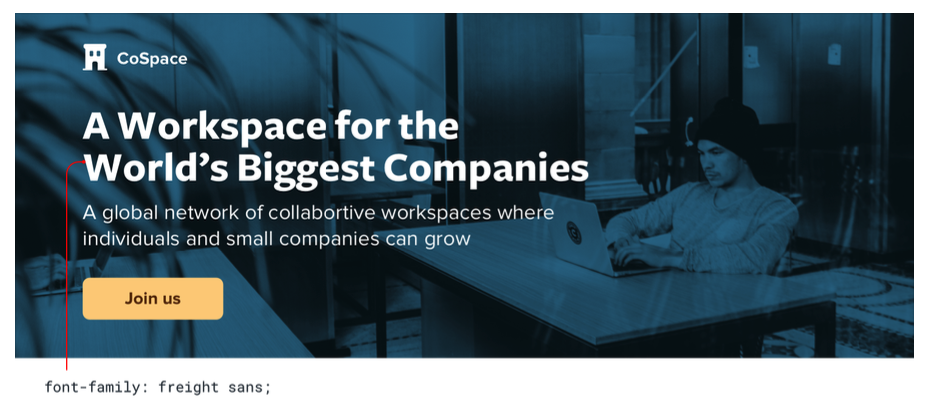
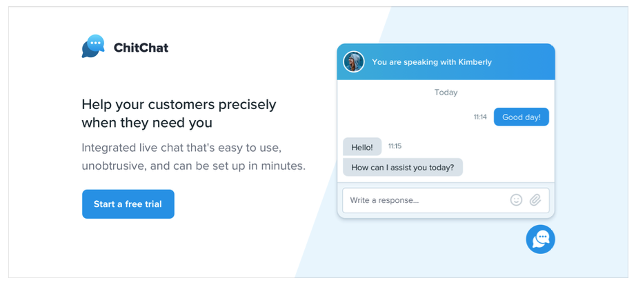
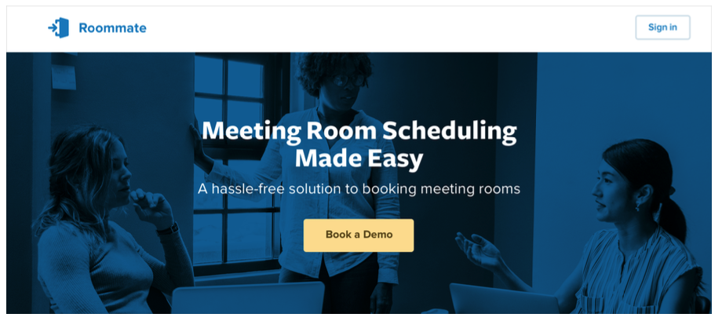
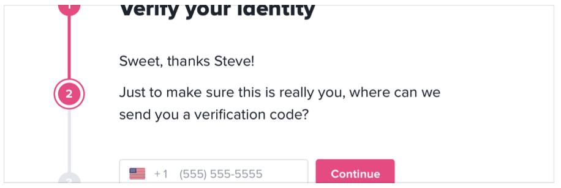
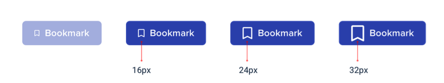

## Sayfa yerleşimi ile değil, bir özellik ile başlayın

Yeni bir uygulama fikri için tasarıma başladığınızda ilk olarak ne tasarlarsınız? Eğer bu bir navigation bar ise, bir hata yapıyorsunuz demektir.

Yeni bir tasarım üzerinde çalışırken kendinizi takılıp kalmış olarak bulmanın en kolay yolu 'uygulamayı tasarlamaya çalışmaktır'. Çoğu insan "uygulamayı tasarlamayı" düşündüğünde, direkt olarak tamamlanmış görünümü düşünür.

Bir top navigation bar mı olmalı yoksa bir sidebar mı olmalı?

Gezinme öğeleri solda mı yoksa sağda mı olmalı?

Sayfa içeriği bir container'da mı yoksa tam genişlikte mi olmalı?

Logo nerede durmalı?

Mesele şu ki, bir "uygulama" aslında bir özellikler koleksiyonudur. Birkaç özellik tasarlamadan önce, navigation'un nasıl çalışması gerektiğine karar vermek için ihtiyacınız olan bilgilere bile sahip değilsiniz. Bu sinir bozucu olabilir!

Tüm sayfayı bir anda tasarlamak yerine, parça parça gerçek işlevsellik ile başlayın.

Örneğin, bir uçuş rezervasyonu hizmeti oluşturduğunuzu varsayalım. “Uçuş arama” gibi bir özellikle başlayabilirsiniz.

Arayüzünüzün ihtiyacı olacak şeyler:

- Kalkış şehri için bir alan
- Hedef şehir için bir alan
- Kalkış tarihi için bir alan
- Dönüş tarihi için bir alan
- Arama yapmak için bir düğme

Bununla başlayın.

Çok iyi, diğer şeylere ihtiyacınız olmayabilir - Bu, Google'da işe yaradı.

## Detaylar sonra gelir

Yeni bir özellik tasarlamanın ilk aşamalarında, yazı biçimleri, gölgeler, simgeler vb. gibi şeyler hakkında düşük düzey kararlar vermeye takılıp kalmamanız önemlidir.

Bu şeylerin hepsi sonunda önemli olacak, ama şu anda önemi yok.

Tarayıcı veya en sevdiğiniz tasarım aracı gibi aslına uygunluğu yüksek bir ortamda çalışırken ayrıntıları göz ardı etmekte zorlanıyorsanız, Basecamp'tan Jason Fried'in kullanmayı sevdiği bir numara, kalın bir Sharpie kullanarak kağıt üzerinde tasarım yapın.

Bir Sharpie ile küçük ayrıntılara takılmak mümkün değildir, bu nedenle farklı bir tasarım fikrini hızla keşfetmenin harika bir yolu olabilir.

### Rengi gizleyin

Bir fikri daha geliştirmeye kesin gözüyle bakıyorsanız, rengi hemen ekleme isteğinize karşı koyun.

Gri tonlamalı tasarım ile bütün kontrast, boşluk ve boyut ayarlarını yapmak zorunda kalırsınız.

Bu sizi biraz zorlayabilir fakat daha sonra renkleri eklediğinizde güçlü bir hiyerarşiye sahip daha net bir arayüz elde edersiniz.

### Aşırı yatırım yapmayın

Düşük kaliteli tasarım yapmanın tüm amacı, hızlı hareket edebilmektir, böylece mümkün olan en kısa sürede gerçek düşünceyi inşa etmeye başlayabilirsiniz

Sketche'ler ve wireframe'ler tek kullanımlıktır; kullanıcılar statik örneklerle hiçbir şey yapamaz. Fikirlerinizi keşfetmek için bunları kullanın ve karar verdiğinizde onları geride bırakın.

## Çok fazla tasarlamayın

Uygulamaya geçmeden önce bir uygulamadaki her özelliği tasarlamanız gerekmez; Aslında, yapmasanız daha iyi.

Bir üründeki her özelliğin nasıl etkileşime girmesi gerektiğini ve her uç durumun nasıl görünmesi gerektiğini anlamak, özellikle soyut olarak gerçekten zordur.

Kullanıcının 2000 kişisi varsa bu ekran nasıl görünmelidir?

Hata mesajı bu formda nereye gitmeli?

Aynı anda programlanmış iki etkinlik olduğunda bu takvim nasıl görünmelidir?

Bu tür şeyleri yalnızca bir tasarım aracı ve hayal gücünüzü kullanarak çözmeye çalışırsanız kendinizi hayal kırıklığına uğratırsınız.

### Döngüler halinde çalışın

Her şeyi önceden tasarlamak yerine, kısa döngüler halinde çalışın. Oluşturmak istediğiniz bir sonraki özelliğin basit bir sürümünü tasarlayarak başlayın.

Temel tasarımdan memnun kaldığınızda, onu gerçeğe dönüştürün.

Muhtemelen yol boyunca bazı beklenmedik karmaşıklıklarla karşılaşacaksınız, ancak asıl mesele bu! Gerçekten kullanabileceğiniz bir arayüzde tasarım sorunlarını çözmek, her son durumu önceden hayal etmekten çok daha kolay.

Çözülecek başka sorun kalmayana kadar çalışan tasarım üzerinde devam edin, ardından tasarım moduna geri dönün ve bir sonraki özellik üzerinde çalışmaya başlayın.

### Karamsar olun

Tasarımlarınıza işlevselliği hazır olmayan özellikleri eklemeyin.

Örneğin, bir proje yönetim aracı için bir yorum sistemi üzerinde çalıştığınızı varsayalım. Bir gün kullanıcıların yorumlarına dosya ekleyebilmelerini istediğinizi biliyorsunuz, bu nedenle tasarımınıza ekler(attachments) bölümü ekliyorsunuz.

Uygulamanın derinliklerine indiğinizde, yorum destekleyici eklerin tahmin ettiğinizden çok daha fazla iş çıkaracağını anladınız. Şu anda bitirmek için zamanınız yok, bu nedenle siz diğer önceliklerle ilgilenirken tüm yorum sistemini arka plana attınız.

Mesele şu ki, ekleri olmayan bir yorum sistemi yine de hiç yorum sistemi olmamasından daha iyi olurdu, ancak onu ilk günden dahil etmeyi planladığınız için gönderebileceğiniz hiçbir şey yok.

Yeni bir özellik tasarlarken, **oluşturmanın zor olmasını bekleyin**. Çıkartacağınız en küçük kullanışlı sürümü tasarlamak, bu riski önemli ölçüde azaltır.

Bir özelliğin parçası "olsa iyi olur" ise, **onu daha sonra tasarlayın**. Önce basit sürümü oluşturun ve her zaman başvuracak bir şeyiniz olur.

## Choose a personality

Every design has some sort of personality. A banking site might try to communicate secure and professional, while a trendy new startup might have a design that feels fun and playful.

On the surface, giving a design a particular personality might sound abstract and handwavy, but a lot of it is determined by a few solid, concrete factors.

### Font choice

Typography plays a huge part in determining how a design feels.

If you want an elegant or classic look, you might want to incorporate a serif typeface in your design:

For a playful look, you could use a rounded sans serif:

If you’re going for a plainer look, or want to rely on other elements to provide the personality, a neutral sans serif works great:

### Color

There’s a lot of science out there on the psychology of color, but in practice, you really just need to pay attention to how different colors feel to you.

Blue is safe and familiar — nobody ever complains about blue:

Gold might say “expensive” and “sophisticated”:

Pink is a bit more fun, and not so serious:

While trying to choose colors using only psychology isn’t super practical — a lot of it is just about what looks good to you — it can be helpful to think about when you’re trying to understand why you think a color is the right fit.

### Border radius

As small of a detail as it sounds, if and how much you round the corners in your design can have a big impact on the overall feel.

A small border radius is pretty neutral, and doesn’t really communicate much of a personality on its own:

A large border radius starts to feel more playful:

...while no border radius at all feels a lot more serious or formal:

Whatever you choose, it’s important to stay consistent. Mixing square corners with rounded corners in the same interface almost always looks worse than sticking with one or the other.

### Language

While not a visual design technique per se, the words you use in an interface have a massive influence on the overall personality.

Using a less personal tone might feel more official or professional:

...while using friendlier, more casual language makes a site feel, well, friendlier:

Words are everywhere in a user interface, and choosing the right ones is just as (if not more) important than choosing the right color or typeface.

### Deciding what you actually want

A lot of the time you’ll probably just have a gut feeling for the personality you’re going for. But if you don’t, a great way to simplify the decision is to take a look at other sites used by the people you want to reach.

If they are mostly pretty “serious business”, maybe that’s how your site should look too. If they are more playful with a bit of humor, maybe that’s a better direction to take.

Just try not to borrow too much from direct competitors, you don’t want to look like a second-rate version of something else.

## Limit your choices

Having millions of colors and thousands of fonts to choose from might sound nice in theory, but in practice it’s usually a paralyzing curse.

And it’s not just fonts and colors, either — you can easily waste time agonizing over almost any minor design decision.

Should this text be 12px or 13px?

Should this box shadow have a 10% opacity or a 15% opacity?

Should this avatar be 24px or 25px tall?

Should I use a medium font weight for this button or semibold?

Should this headline have a bottom margin of 18px or 20px?

When you’re designing without constraints, decision-making is torture because there’s always going to be more than one right choice.

For example, these buttons all have different background colors, but it’s almost impossible to tell the difference between them by just looking at them.

How are you supposed to make a confident decision if none of these would really be bad choices?

### Define systems in advance

Instead of hand-picking values from a limitless pool any time you need to make a decision, start with a smaller set of options.

Don’t reach for the color picker every time you need to pick a new shade of blue — choose from a set of 8-10 shades picked out ahead of time.

Similarly, don’t tweak a font size one pixel at a time until it looks perfect. Define a restrictive type scale in advance and use that to make any future font size decisions.

When you build systems like this, you only have to do the hard work of picking the initial values once instead of every time you’re designing a new piece of UI. It’s a bit more work up front, but it’s worth it — it’ll save you a ton of decision fatigue down the road.

### Designing by process of elimination

When you’re designing using a constrained set of values, decision-making is a lot easier because there are a lot fewer “right” choices.

For example, say you’re trying to choose a size for an icon. You’ve defined a sizing scale in advance where your only small-to-medium sized options are 12px, 16px, 24px, and 32px.

To pick the best option, start by taking a guess at which one will look best, maybe 16px. Then try the values on either side (12px and 24px) for comparison.

Chances are, two of those options will seem like obviously bad choices. If it’s the options on the outside, you’re done — the middle option is the only good choice.

If one of the outer options looks best, do another comparison using that option as the “middle” value and make sure there’s not a better choice.

This approach works for anything where you’ve defined a system. When you’re limited to a set of options that all look noticeably different, picking the best one is a piece of cake.

### Systematize everything

The more systems you have in place, the faster you’ll be able to work and the less you’ll second guess your own decisions.

You’ll want systems for things like:

- Font size
- Font weight
- Line height
- Color
- Margin
- Padding
- Width
- Height
- Box shadows
- Border radius
- Border width 
- Opacity

...and anything else you run into where it feels like you’re laboring over a low- level design decision.

You don’t have to define all of this stuff ahead of time, just make sure you’re approaching design with a system-focused mindset. Look for opportunities to introduce new systems as you make new decisions, and try to avoid having to make the same minor decision twice.

Designing with systems is going to be a recurring theme throughout this book, and in later chapters we’ll talk about building a lot of these systems in finer detail.