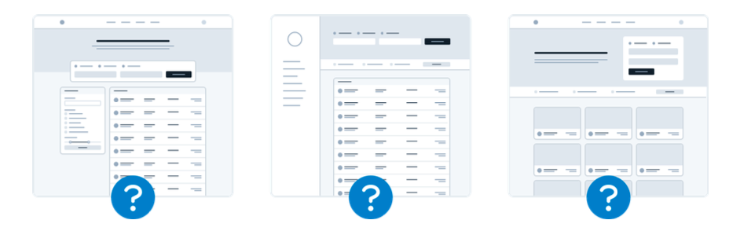

## Start with a feature, not a layout

When you start the design for a new app idea, what do you design first? If it’s the navigation bar at the top of the page, you’re making a mistake.

The easiest way to find yourself frustrated and stuck when working on a new design is to start by trying to “design the app.” When most people think about “designing the app”, they’re thinking about the shell.

Should it have a top nav, or a sidebar?

Should the navigation items be on the left, or on the right?

Should the page content be in a container, or should it be full-width?

Where should the logo go?

The thing is, an “app” is actually a collection of features. Before you’ve designed a few features, you don’t even have the information you need to make a decision about how the navigation should work. No wonder it’s frustrating!

Instead of starting with the shell, start with a piece of actual functionality.

For example, say you’re building a flight booking service. You could start with a feature like “searching for a flight”.

Your interface will need:

- A field for the departure city
- A field for the destination city
- A field for the departure date
- A field for the return date
- A button to perform the search

Start with that.

Hell, you might not even need that other stuff anyways — it worked for Google.

## Detail comes later

In the earliest stages of designing a new feature, it’s important that you don’t get hung up making low-level decisions about things like typefaces, shadows, icons, etc.

That stuff will all matter eventually, but it doesn’t matter right now.

If you have trouble ignoring the details when working in a high fidelity environment like the browser or your favorite design tool, one trick Jason Fried of Basecamp likes to use is to design on paper using a thick Sharpie.

Obsessing over little details just isn’t possible with a Sharpie, so it can be a great way to quickly explore a bunch of different layout ideas.

### Hold the color

Even when you’re ready to refine an idea in higher fidelity, resist the temptation to introduce color right away.

By designing in grayscale, you’re forced to use spacing, contrast, and size to do all of the heavy lifting.

It’s a little more challenging, but you’ll end up with a clearer interface with a strong hierarchy that’s easy to enhance with color later.

### Don’t over-invest

The whole point of designing in low-fidelity is to be able to move fast, so you can start building the real thing as soon as possible.

Sketches and wireframes are disposable — users can’t do anything with static mockups. Use them to explore your ideas, and leave them behind when you’ve made a decision.

## Don’t design too much

You don’t need to design every single feature in an app before you move on to implementation; in fact, it’s better if you don’t.

Figuring out how every feature in a product should interact and how every edge case should look is really hard, especially in the abstract.

How should this screen look if the user has 2000 contacts?

Where should the error message go in this form?

How should this calendar look when there are two events scheduled at the same time?

You’re setting yourself up for frustration by trying to figure this stuff out using only a design tool and your imagination.

### Work in cycles

Instead of designing everything up front, work in short cycles. Start by designing a simple version of the next feature you want to build.

Once you’re happy with the basic design, make it real.

You’ll probably run into some unexpected complexity along the way, but that’s the point — it’s a lot easier to fix design problems in an interface you can actually use than it is to imagine every edge case in advance.

Iterate on the working design until there are no more problems left to solve, then jump back into design mode and start working on the next feature.

### Be a pessimist

Don’t imply functionality in your designs that you aren’t ready to build.

For example, say you’re working on a comment system for a project management tool. You know that one day, you’d like users to be able to attach files to their comments, so you include an attachments section in your design.

You get deep into implementation only to discover that supporting attachments is going to be a lot more work than you anticipated. There’s no way you have time to finish it right now, so the whole commenting system sits on the backburner while you take care of other priorities.

The thing is, a comment system with no attachments would still have been better than no comment system at all, but because you planned to include it from day one you’ve got nothing you can ship.

When you’re designing a new feature, **expect it to be hard to build**. Designing the smallest useful version you can ship reduces that risk considerably.

If part of a feature is a “nice-to-have”, **design it later**. Build the simple version first and you’ll always have something to fall back on.

## Choose a personality

Every design has some sort of personality. A banking site might try to communicate secure and professional, while a trendy new startup might have a design that feels fun and playful.

On the surface, giving a design a particular personality might sound abstract and handwavy, but a lot of it is determined by a few solid, concrete factors.