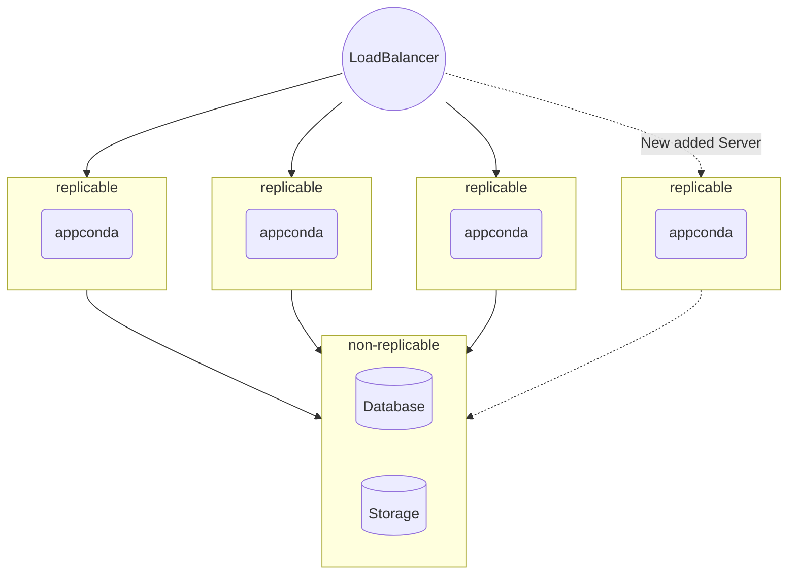

# Horizontal Scaling

After you've decentralized your Database and Storage, you can go into horizontal scaling. If you haven't done so make sure to that first.

Horizontal scaling is adding more Client instances and balances the input using a load balancer. Horizontal means that the scaling is going to expand from one side to another, which means that instead of N instance you are going to expand to N + H instances.

Here's a diagram that illustrates the infrastructure, notice the far right dashed line represents a newly added server.



---

## Duplicate client instances
In the previous chapter you have created the main and client servers, When you have these two servers, scaling is very easy, just follow these steps.

1. Turn of the client server.
2. Create a snapshot of that server.
3. Turn the client server back on.
4. Create as many as needed servers and make them use the client snapshot you've just created.
5. Assign the client tag/label (depends on the IaaS provider) to all of the client instances.
   
Now, every time you'll access any of the newly created servers IP, you'll get the same Appconda instance.

### Tag-based load-balancer
That part alone won't give you horizontal-scaled Appconda, to complete that process you'll need to utilize a load-balancer and make balance between all your client instances.

Most IaaS load-balancers let you balance the traffic by tag.

Then all you need to do is point your domain to the load-balancer IP, doing so will make sure any request made to your Appconda domain will be balanced between your client instances.

### More DB connection
In case you're scaling up and up it's necessary to let your MariaDB have more than the 151 default connections limit.

To do so, edit your main server docker-compose.yml file and add this line

:::note[docker-compose.yml]

```shell 
services:
  mariadb:
    image: mariadb:10.7
    container_name: appconda-mariadb
    ports:
      - "3306:3306"
    restart: unless-stopped
    networks:
      - gateway
    volumes:
      - appconda-mariadb:/var/lib/mysql:rw
      - /root/databases/my.cnf:/etc/mysql/my.cnf:rw 
    environment:
      - MYSQL_ROOT_PASSWORD
      - MYSQL_DATABASE
      - MYSQL_USER
      - MYSQL_PASSWORD
    command: 'mysqld --innodb-flush-method=fsync'
```
:::

This line will make MariaDB load is settings from the local /root/databases/my.cnf file. Create this file

```shell
nano /root/databases/my.cnf
```

And paste the following content in it to change the max connection up to 1000.

:::note[my.cnf]
```shell
[client-server]
socket = /run/mysqld/mysqld.sock
!includedir /etc/mysql/mariadb.conf.d/
!includedir /etc/mysql/conf.d/
[mysqld]
max_connections = 1000
```
:::

You can change the `1000` of `max_connection` to any other higher number, just make sure your main server can handle it.

Then, reload the Docker compose by running:

```shell
docker compose down && docker compose up -d
```

---

## Upgrade
Upgrading an HA cluster of Appconda must be done manually following these steps, make sure to choose the most-quite time in your server.

1. Create a strong replication of your client server. You want to create a strong one, so the inside process will be as fast as possible
2. Don't give the new server the load-balancer tag
3. Edit the docker-compose.yml file change the Appconda image version to new one
4. Run docker compose up -d that will download the new image and update the infrastructure to the latest version
5. In case there's a need of migrate run docker exec appconda migrate
6. Turn off the new server
7. Take a snapshot of the new server
8. Delete the new server
9. Create N servers using the new snapshot, where N equeal to the number of client servers you're using right now.
10. Add the load-balancer tag to newly created servers.
11. Remove the load-balancer tag from the old version servers.
12. Check that everything is in order.
13. Delete the old servers.
    
You can automate most of the process from step 6-13 by using your IaaS API. For now, this part is outside the scope of this book.

## Benchmarks

Go to Benchmarks to see how Appconda is handling request when scaling it horizontally.

---

## Ansible

In the book repo in the horizontal folder, you'll find ansible file for automating the whole installation process.

You'll need to set just the servers IP and run

```shell
ansible-playbook appconda.yml --ask-vault-pass
```