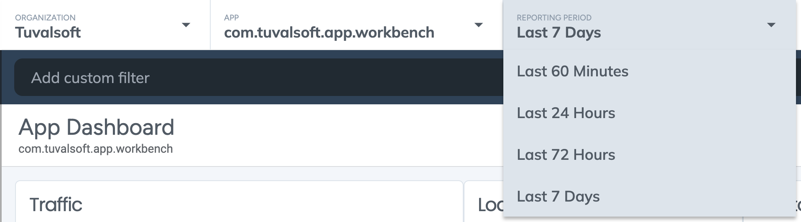

Top dropdown wıdget'ı menu gosterımlerinde kullanılmak için uygundur.

Kullanımı;

```ts
UIWidget("com.tuvalsoft.widget.topdropdown")
  .config({
    title: "App",
    selectedValue: "4",
    width: "350px",
  })
  .data([
    {
      text: "Last 60 Minutes",
      value: "1",
    },
    {
      text: "Last 24 Hours",
      value: "2",
    },
    {
      text: "Last 72 Hours",
      value: "3",
    },
    {
      text: "Last 7 Days",
      value: "4",
    },
  ]);
```

### Config Properties

| Name            | Type   | Scriptable | Default |
| --------------- | ------ | ---------- | ------- |
| `title`         | string | Yes        | `''`    |
| `placeholder`   | string | Yes        | `''`    |
| `selectedValue` | string | Yes        | `''`    |


#### Typescript Type

```ts
export interface IConfig {
  title?: string | (()=>string);
  placeholder?: string | (()=>string);
  selectedValue?: string | (()=>string);
}

export interface IData {
  text: string;
  value: string;
}

```