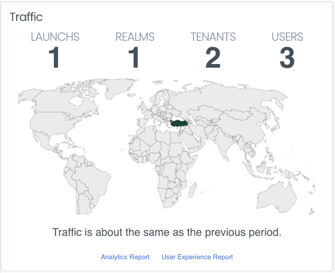

Worldmap ulkeleri göstermek için kullanılır. Haritanın görselleştirilmesi verilere göre biçimlenir veya gölgelenir. Bu özellik değerleri bir coğrafi haritada farklılıklarına göre görselleştirme imkanı sunar.

Renklendirme süreçlerinde haritadaki her bir ulke için veri değişkenleri kullanılır. Öz bir şekilde söylemek gerekirse bu coğrafi harita üzerinde tüm renk spektrumunda karışımlar ve nüanslar yaratma imkanı ile birlikte şeffaf, aydınlık veya karanlık; kullanıcıya bir sürü dizayn imkanı sunmaktadır.

Baslik alanina isteniler gostergeler baslik olarak eklenebilir.

RealmApp icerisinde kullanimi asagidaki gibidir.
```ts
UIWidget().qn('com.tuvalsoft.widget.worldmap')
          .config({
              title: 'Traffic',
              headerItems: [{
                  name:'STARTS',
                  value: 12
              },
              {
                  name:'REALMS',
                  value: 12
              },
              {
                  name:'TENANTS',
                  value: 12
              },
              {
                  name:'USERS',
                  value: 12
              }]
          })
          .data({
              geoCounts: {
                  'TR': 10,
                  'US': 20
              }
          })
```
### Config Properties


| Name          | Type                          | Scriptable | Default |
| ------------- | ----------------------------- | ---------- | ------- |
| `title`       | string                        | Yes        | `''`    |
| `headerItems` | [IHeaderItem[]](#IHeaderItem) | Yes        | `[]`    |
| `footer`      | string                        | Yes        | ''      |
| `footerItems` | [IFooterItem[]](#IFooterItem) | Yes        | `[]`    |

#### Typescript Type
```ts
export interface IConfig {
    title?: string;
    headerItems?: IHeaderItem[];
    footer?: string | (() => string);
    footerItems?: (IFooterItem | UIView)[];
}

```

### HeaderItem<a name="IHeaderItem"></a>
| Name    | Type   | Scriptable | Default |
| ------- | ------ | ---------- | ------- |
| `name`  | string | No         | null    |
| `value` | string | Yes        | null    |

```ts
export interface IHeaderItem {
    name: string;
    value: string | Function;
}


export interface IData {
    geoCounts: [key: string];
} 

```


### FooterItem<a name="IFooterItem"></a>

| Name    | Type   | Scriptable | Default |
| ------- | ------ | ---------- | ------- |
| `name`  | string | No         | null    |
| `value` | string | Yes        | null    |

```ts
export interface IFooterItem {
    name: string;
    value: string | Function;
}
```

### Country codes<a name="CountryCodes"></a>

Country codes using in data geo counts:

```
  "AF": "Afghanistan",
  "AL": "Albania",
  "DZ": "Algeria",
  "AS": "American Samoa",
  "AD": "Andorra",
  "AO": "Angola",
  "AI": "Anguilla",
  "AQ": "Antarctica",
  "AG": "Antigua and Barbuda",
  "AR": "Argentina",
  "AM": "Armenia",
  "AW": "Aruba",
  "AU": "Australia",
  "AT": "Austria",
  "AZ": "Azerbaijan",
  "BS": "Bahamas",
  "BH": "Bahrain",
  "BD": "Bangladesh",
  "BB": "Barbados",
  "BY": "Belarus",
  "BE": "Belgium",
  "BZ": "Belize",
  "BJ": "Benin",
  "BM": "Bermuda",
  "BT": "Bhutan",
  "BO": "Bolivia, Plurinational State of",
  "BQ": "Bonaire, Sint Eustatius and Saba",
  "BA": "Bosnia and Herzegovina",
  "BW": "Botswana",
  "BV": "Bouvet Island",
  "BR": "Brazil",
  "IO": "British Indian Ocean Territory",
  "BN": "Brunei Darussalam",
  "BG": "Bulgaria",
  "BF": "Burkina Faso",
  "BI": "Burundi",
  "CV": "Cabo Verde",
  "KH": "Cambodia",
  "CM": "Cameroon",
  "CA": "Canada",
  "KY": "Cayman Islands",
  "CF": "Central African Republic",
  "TD": "Chad",
  "CL": "Chile",
  "CN": "China",
  "CX": "Christmas Island",
  "CC": "Cocos (Keeling) Islands",
  "CO": "Colombia",
  "KM": "Comoros",
  "CG": "Congo",
  "CD": "Congo, the Democratic Republic of the",
  "CK": "Cook Islands",
  "CR": "Costa Rica",
  "CI": "C\u00F4te d\u0027Ivoire",
  "HR": "Croatia",
  "CU": "Cuba",
  "CW": "Cura\u00E7ao",
  "CY": "Cyprus",
  "CZ": "Czechia",
  "DK": "Denmark",
  "DJ": "Djibouti",
  "DM": "Dominica",
  "DO": "Dominican Republic",
  "EC": "Ecuador",
  "EG": "Egypt",
  "SV": "El Salvador",
  "GQ": "Equatorial Guinea",
  "ER": "Eritrea",
  "EE": "Estonia",
  "SZ": "Eswatini",
  "ET": "Ethiopia",
  "FK": "Falkland Islands (Malvinas)",
  "FO": "Faroe Islands",
  "FJ": "Fiji",
  "FI": "Finland",
  "FR": "France",
  "GF": "French Guiana",
  "PF": "French Polynesia",
  "TF": "French Southern Territories",
  "GA": "Gabon",
  "GM": "Gambia",
  "GE": "Georgia",
  "DE": "Germany",
  "GH": "Ghana",
  "GI": "Gibraltar",
  "GR": "Greece",
  "GL": "Greenland",
  "GD": "Grenada",
  "GP": "Guadeloupe",
  "GU": "Guam",
  "GT": "Guatemala",
  "GG": "Guernsey",
  "GN": "Guinea",
  "GW": "Guinea-Bissau",
  "GY": "Guyana",
  "HT": "Haiti",
  "HM": "Heard Island and McDonald Islands",
  "VA": "Holy See",
  "HN": "Honduras",
  "HK": "Hong Kong",
  "HU": "Hungary",
  "IS": "Iceland",
  "IN": "India",
  "ID": "Indonesia",
  "IR": "Iran",
  "IQ": "Iraq",
  "IE": "Ireland",
  "IM": "Isle of Man",
  "IL": "Israel",
  "IT": "Italy",
  "JM": "Jamaica",
  "JP": "Japan",
  "JE": "Jersey",
  "JO": "Jordan",
  "KZ": "Kazakhstan",
  "KE": "Kenya",
  "KI": "Kiribati",
  "KP": "Korea, Democratic People\u0027s Republic of",
  "KR": "South Korea",
  "KW": "Kuwait",
  "KG": "Kyrgyzstan",
  "LA": "Lao People\u0027s Democratic Republic",
  "LV": "Latvia",
  "LB": "Lebanon",
  "LS": "Lesotho",
  "LR": "Liberia",
  "LY": "Libya",
  "LI": "Liechtenstein",
  "LT": "Lithuania",
  "LU": "Luxembourg",
  "MO": "Macao",
  "MG": "Madagascar",
  "MW": "Malawi",
  "MY": "Malaysia",
  "MV": "Maldives",
  "ML": "Mali",
  "MT": "Malta",
  "MH": "Marshall Islands",
  "MQ": "Martinique",
  "MR": "Mauritania",
  "MU": "Mauritius",
  "YT": "Mayotte",
  "MX": "Mexico",
  "FM": "Micronesia, Federated States of",
  "MD": "Moldova, Republic of",
  "MC": "Monaco",
  "MN": "Mongolia",
  "ME": "Montenegro",
  "MS": "Montserrat",
  "MA": "Morocco",
  "MZ": "Mozambique",
  "MM": "Myanmar",
  "NA": "Namibia",
  "NR": "Nauru",
  "NP": "Nepal",
  "NL": "Netherlands",
  "NC": "New Caledonia",
  "NZ": "New Zealand",
  "NI": "Nicaragua",
  "NE": "Niger",
  "NG": "Nigeria",
  "NU": "Niue",
  "NF": "Norfolk Island",
  "MP": "Northern Mariana Islands",
  "MK": "North Macedonia",
  "NO": "Norway",
  "OM": "Oman",
  "PK": "Pakistan",
  "PW": "Palau",
  "PS": "Palestine, State of",
  "PA": "Panama",
  "PG": "Papua New Guinea",
  "PY": "Paraguay",
  "PE": "Peru",
  "PH": "Philippines",
  "PN": "Pitcairn",
  "PL": "Poland",
  "PT": "Portugal",
  "PR": "Puerto Rico",
  "QA": "Qatar",
  "RE": "R\u00E9union",
  "RO": "Romania",
  "RU": "Russia",
  "RW": "Rwanda",
  "BL": "Saint Barth\u00E9lemy",
  "SH": "Saint Helena, Ascension and Tristan da Cunha",
  "KN": "Saint Kitts and Nevis",
  "LC": "Saint Lucia",
  "MF": "Saint Martin (French part)",
  "PM": "Saint Pierre and Miquelon",
  "VC": "Saint Vincent and the Grenadines",
  "WS": "Samoa",
  "SM": "San Marino",
  "ST": "Sao Tome and Principe",
  "SA": "Saudi Arabia",
  "SN": "Senegal",
  "RS": "Serbia",
  "SC": "Seychelles",
  "SL": "Sierra Leone",
  "SG": "Singapore",
  "SX": "Sint Maarten (Dutch part)",
  "SK": "Slovakia",
  "SI": "Slovenia",
  "SB": "Solomon Islands",
  "SO": "Somalia",
  "ZA": "South Africa",
  "GS": "South Georgia and the South Sandwich Islands",
  "SS": "South Sudan",
  "ES": "Spain",
  "LK": "Sri Lanka",
  "SD": "Sudan",
  "SR": "Suriname",
  "SJ": "Svalbard and Jan Mayen",
  "SE": "Sweden",
  "CH": "Switzerland",
  "SY": "Syrian Arab Republic",
  "TW": "Taiwan",
  "TJ": "Tajikistan",
  "TZ": "Tanzania, United Republic of",
  "TH": "Thailand",
  "TL": "Timor-Leste",
  "TG": "Togo",
  "TK": "Tokelau",
  "TO": "Tonga",
  "TT": "Trinidad and Tobago",
  "TN": "Tunisia",
  "TR": "Turkey",
  "TM": "Turkmenistan",
  "TC": "Turks and Caicos Islands",
  "TV": "Tuvalu",
  "UG": "Uganda",
  "UA": "Ukraine",
  "AE": "United Arab Emirates",
  "GB": "UK",
  "US": "USA",
  "UM": "United States Minor Outlying Islands",
  "UY": "Uruguay",
  "UZ": "Uzbekistan",
  "VU": "Vanuatu",
  "VE": "Venezuela",
  "VN": "Vietnam",
  "VG": "Virgin Islands, British",
  "VI": "Virgin Islands, U.S.",
  "WF": "Wallis and Futuna",
  "EH": "Western Sahara",
  "YE": "Yemen",
  "ZM": "Zambia",
  "ZW": "Zimbabwe",
  "AX": "\u00C5land Islands",
  "XK": "Kosovo",
  "": "Unknown"
```